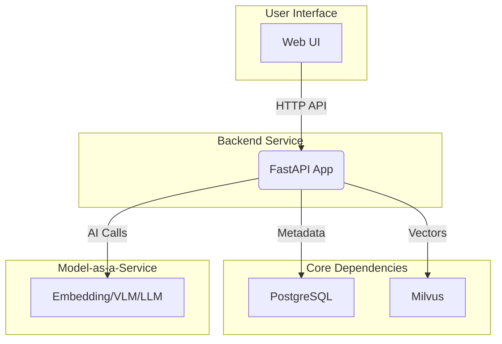
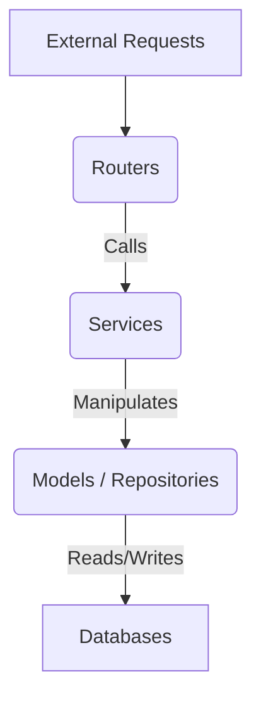
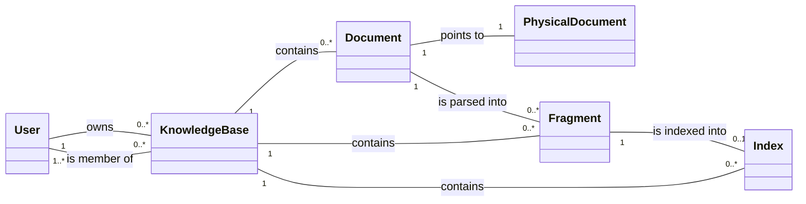

# Kosmos Agent Development Guide (GEMINI.md)

本文档是指导 AI Agent 对 Kosmos 项目进行后续开发和维护的核心纲领。所有未来的代码修改、功能添加或重构都必须严格遵守本文档中描述的设计哲学、架构原则和开发规范。

## 1. 设计哲学 (Design Philosophy)

-   **可插拔的智能 (Pluggable Intelligence)**: Kosmos 的核心不是模型，而是**管理和调度模型**的框架。所有 AI 能力（Embedding, VLM, LLM）都必须通过 `CredentialService` 和 `KBModelConfig` 作为外部服务进行集成，以保证模型的灵活性和可替换性。
-   **语义优先 (Semantic First)**: 系统的所有设计都应服务于最终的语义检索质量。数据的处理（解析、分片）和组织（标签、索引）应以最大化保留和利用内容的语义信息为首要目标。
-   **异步 by Default (Asynchronous by Default)**: 任何可能耗时超过 500ms 的操作（文件 I/O, 模型调用, 批量处理）都**必须**通过 `UnifiedJobService` 进行异步处理，以保证 API 的快速响应和系统的可伸缩性。
-   **多模态融合 (Multi-modal Fusion)**: 系统的目标是统一处理多模态知识。在设计上，应始终考虑如何将不同模态的信息（如图像的视觉内容和文本的上下文）有效融合，而不是孤立处理。
-   **企业级就绪 (Enterprise-Ready)**: 所有功能设计都应考虑多租户（知识库隔离）、权限控制和数据安全。

## 2. 系统架构

### 2.1. 宏观架构

系统由四大组件构成：Web UI、后端服务、核心依赖（数据库）和外部模型服务。

### 2.2. 后端分层架构

后端严格遵循 `Router` -> `Service` -> `Model/Repository` 的三层架构。

-   **Routers**: 仅负责 API 的定义、请求验证和响应格式化。**严禁**在路由层包含业务逻辑。
-   **Services**: 系统的核心，负责编排所有业务逻辑、事务管理和调用外部服务。
-   **Models/Repositories**: 负责数据持久化。`Models` (SQLAlchemy) 定义了 PostgreSQL 的数据结构，`Repositories` (e.g., `MilvusRepository`) 封装了对 Milvus 等非关系型数据库的访问。

## 3. 核心抽象与数据模型

系统的知识体系由四大核心抽象构成，其关系如下：

-   **KnowledgeBase**: 顶层隔离容器，拥有独立的用户、配置和 `tag_dictionary`。
-   **Document & PhysicalDocument**: **逻辑文档**代表上传行为，**物理文档**代表唯一的文件内容（通过 `content_hash` 识别）。此设计是存储优化的关键。
-   **Fragment**: 文档解析后的最小知识单元。`fragment_type` (`text`, `screenshot`, `figure`) 和 `meta_info` (如页码) 是其关键属性。
-   **Index**: 对一个 `text` Fragment 加工后的可检索记录，包含 `tags`，其内容的向量存储在 Milvus 中。

## 4. 关键业务流程 (Flows)

-   **文档摄入 (Document Ingestion)**: 这是最核心的流程，由 `UnifiedJobService` 调度的异步任务。
    1.  **解析 (Parsing)**: `FragmentParserService` 负责。目标是**结构化**与**多模态理解**。
        -   **PDF-like 文档**: 提取文本流和图片 -> 为图片调用 **VLM** 生成描述 -> 将描述**插回**文本流 -> 对增强后的文本流进行智能分割，产出 `text`, `screenshot`, `figure` Fragments。
        -   **独立图像**: 调用 **VLM** 生成描述，产出 1 个 `figure` Fragment 和 1 个 `text` Fragment。
        -   **纯文本**: 直接进行智能文本分割。
    2.  **索引 (Indexing)**: `IndexService` 负责。目标是**可检索化**。
        -   仅针对包含文本内容的 `Fragment` (包括 VLM 生成的描述)。
        -   调用 **Embedding 模型**生成向量，存入 Milvus。
        -   调用 **LLM** 结合 `tag_dictionary` 生成标签，存入 PostgreSQL 的 `indexes` 表。

-   **语义搜索 (Semantic Search)**: 一个多阶段管道，由 `SearchService` 编排。
    1.  **召回 (Recall)**: 在 Milvus 中进行向量检索，并用 `must_tags` / `must_not_tags` 进行预过滤。
    2.  **重排 (Rerank)**: 根据 `like_tags` 对召回结果进行加权排序。
    3.  **上下文构建 (Contextualization)**: 对最终的文本结果，根据其页码元数据，反向查找关联的 `screenshot` 和 `figure` 片段。
    4.  **智能推荐 (Tag Recommendation)**: 基于 `ITD (Inverse Tag Density)` 算法，推荐与当前结果集高度相关且具有区分度的标签。

## 5. 开发规范 (Development Conventions)

1.  **严格遵守分层架构**:
    -   业务逻辑**必须**在 `Service` 层实现。`Router` 层应保持“薄”，仅做请求转发和验证。
    -   数据库的直接交互**必须**通过 `Model` (SQLAlchemy) 或 `Repository` (Milvus) 进行。

2.  **异步任务优先**:
    -   任何与文件系统交互、调用外部 API (MaaS)、或循环处理超过少量（~10）条数据库记录的操作，都**必须**通过 `UnifiedJobService` 实现为异步任务。

3.  **配置驱动**:
    -   所有外部服务的地址、密钥、模型名称等参数，都**必须**通过 `.env` 文件进行配置。代码中严禁出现硬编码的配置项。
    -   与 AI 模型相关的功能，**必须**与 `KBModelConfig` 关联，确保其可由用户在知识库级别进行配置。

4.  **数据模型与 Schema**:
    -   数据库结构的变更**必须**在 `app/models/` 中以 SQLAlchemy 类的形式定义。
    -   所有 API 的输入输出**必须**使用 `app/schemas/` 中的 Pydantic 模型进行定义，以确保数据验证和序列化的一致性。

5.  **依赖注入**:
    -   **必须**使用 FastAPI 的依赖注入系统来获取共享资源，尤其是 `db: Session = Depends(get_db)` 和 `current_user: User = Depends(get_current_user)`。

6.  **代码风格**:
    -   遵循 `PEP 8` 规范，并参考项目已有的 `.pylintrc` 配置。
    -   代码风格、命名约定、注释风格等，**必须**与项目中现有代码保持高度一致。在修改文件前，先阅读并理解该文件的现有风格。