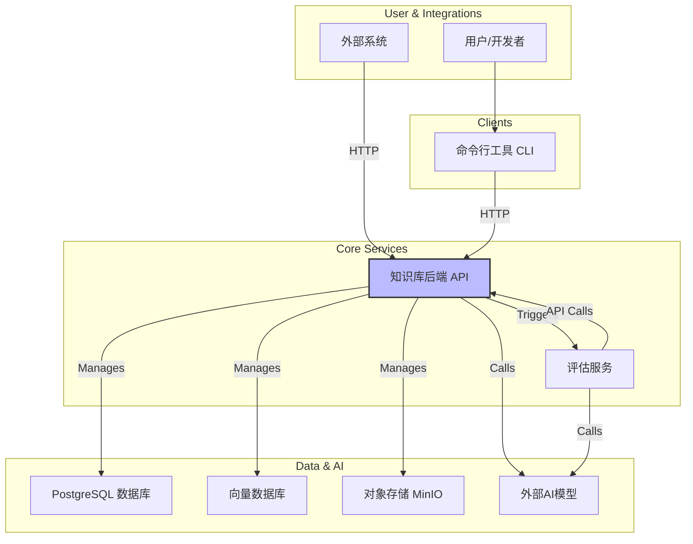

# Kosmos：下一代智能知识管理与评估平台

Kosmos 是一个 **API驱动**的、集知识处理、智能检索和自主评估于一体的综合性平台。它旨在将非结构化的数据（如文档、报告）转化为一个动态演进、高度结构化的知识库，并通过自主AI Agent对知识进行深度分析与合规性评估。

## Agentic Application 开发新范式

Kosmos不仅仅是一个知识管理工具，它代表了一种新兴的**Agentic Application（代理式应用）**开发范式。这种范式专为构建与大型语言模型（LLM）深度集成、以自主代理（Agent）为核心的复杂应用而设计。其核心思想是通过一系列精心设计的组件，为Agent提供稳定、可控、高效的运行环境。

### 1. 轻量级、多接口的知识库访问

传统RAG（检索增强生成）系统常因复杂的查询改写、意图识别和重排序流程而变得臃肿且难以调试。Kosmos回归本源，为Agent提供了一套**轻量级、功能明确**的知识访问接口，让Agent自行决定如何获取信息：

-   **搜索 (Search)**: 用于基于语义或关键词的探索性查询，适合Agent在不确定信息位置时使用。
-   **模式匹配 (Grep)**: 提供在单个文档内进行快速、精准的正则表达式匹配，适合Agent根据特定模式（如IP地址、错误码）进行定位。
-   **定位读取 (Read)**: 允许Agent在通过前两种方式定位到信息后，精确地读取上下文，并获取关联的元数据（如原始页码和相关资产）。

这种多接口设计将信息获取的策略制定权交还给Agent，简化了知识库本身，使其更像一个稳定、可预测的“文件系统”，而非一个黑盒式的“问答引擎”。

### 2. 功能强大的CLI：Agent开发的“IDE”

Kosmos的命令行接口（CLI）不仅是用户的管理工具，更是Agent开发与调试的核心环境。

-   **命令即API**: CLI中的每一个命令都清晰地对应一个后端API调用。这使得开发者可以轻松地在交互式探索和自动化脚本之间切换。
-   **促进开发调试**: 开发者可以手动模拟Agent的操作流程（`search` -> `read` -> `add-evidence` -> `update-finding`），在真实环境中逐步调试和优化Agent的决策逻辑，极大地提高了开发效率。
-   **人机协作**: CLI使得人类专家可以无缝介入Agent的工作流，进行监督、修正或接管，实现了真正的人机协作闭环。

### 3. 有状态、代理式的任务服务器

为了对Agent的操作施加有效的治理，Kosmos引入了**有状态、代理式（Proxy-like）的任务服务器**（以`Assessment Service`为首个实例）。

-   **状态管理**: 任务服务器拥有自己的数据库和状态机（FSM），用于管理一个长期运行任务（如一次评估）的完整生命周期。
-   **操作级治理**: Agent的所有知识库访问请求（如`search`, `read`）都必须通过任务服务器的API进行。任务服务器作为代理，在将请求转发给核心知识库之前，会执行关键的治理操作：
    -   **权限验证**: 确保Agent只在当前会话（Session）的授权范围内活动。
    -   **状态检查**: 验证当前任务状态是否允许执行该操作。
    -   **资源控制**: 记录操作次数，实施速率限制或熔断机制，防止Agent失控。
    -   **审计日志**: 对Agent的每一次操作进行精确记录，为后续的分析和回溯提供依据。

这种架构将Agent的“大脑”（决策逻辑）与“身体”（执行环境）分离，通过一个受控的“神经中枢”（任务服务器）进行连接，从而在赋予Agent高度自主性的同时，保证了整个系统的安全性、可观测性和稳定性。

## 快速开始 (开发环境)

1.  **配置环境**: 复制 `.env_example` 为 `.env` 并填入数据库、AI模型等必要的凭证信息。
2.  **安装依赖**:
    ```bash
    # 创建虚拟环境
    python -m venv .venv
    source .venv/bin/activate
    
    # 安装依赖
    pip install -r requirements.txt
    pip install -r backend/requirements.txt
    pip install -r assessment_service/requirements.txt
    ```
3.  **启动核心服务**:
    打开三个独立的终端来分别启动以下服务。

    *   **终端 1: 启动知识库后端 (KB Backend)**
        ```bash
        source .venv/bin/activate
        uvicorn backend.app.main:app --host 127.0.0.1 --port 8011 --reload --reload-dir backend/app
        ```

    *   **终端 2: 启动后台任务工作单元 (Dramatiq Workers)**
        ```bash
        source .venv/bin/activate
        dramatiq backend.app.tasks -p 1 -t 1
        ```

    *   **终端 3: 启动评估服务 (Assessment Service)**
        ```bash
        source .venv/bin/activate
        uvicorn assessment_service.app.main:app --reload --host 127.0.0.1 --port 8015 --reload-dir assessment_service/app
        ```

4.  **使用CLI**:
    打开第四个终端，激活虚拟环境后即可使用CLI。
    ```bash
    source .venv/bin/activate
    
    # 登录平台
    python -m cli.main --username <user> --password <pass> ...

    # 示例：上传文档
    python -m cli.main --ks-id <your-ks-id> upload "path/to/your/document.pdf"
    ```

## 系统架构

Kosmos 平台由三大核心组件构成：**知识库后端 (KB Backend)**、**评估服务 (Assessment Service)** 和 **命令行接口 (CLI)**。所有交互都围绕着知识库后端的API进行。



*   **知识库后端 (KB Backend)**: 平台的核心，通过一套全面的API暴露其所有能力。它负责知识的摄入、处理、存储和检索，并管理着所有的数据模型和异步处理作业。
*   **评估服务 (Assessment Service)**: 一个独立的、专注的服务，负责执行具体的评估任务。它通过调用知识库API来获取知识和证据。
*   **命令行接口 (CLI)**: 开发者和管理员与Kosmos平台交互的主要工具，本质上是后端API的一个功能强大的客户端。

## 核心组件详解

*   **[深入了解知识库 (Kosmos KB)的设计哲学与API工作流](./docs/Kosmos_KB_Explained.md)**
*   **[掌握命令行工具 (Kosmos CLI) 的使用方法](./docs/Kosmos_CLI_Guide.md)**
*   **[探索评估服务 (Assessment Service) 的自主Agent工作模式](./docs/Kosmos_Assessment_Workflow.md)**
