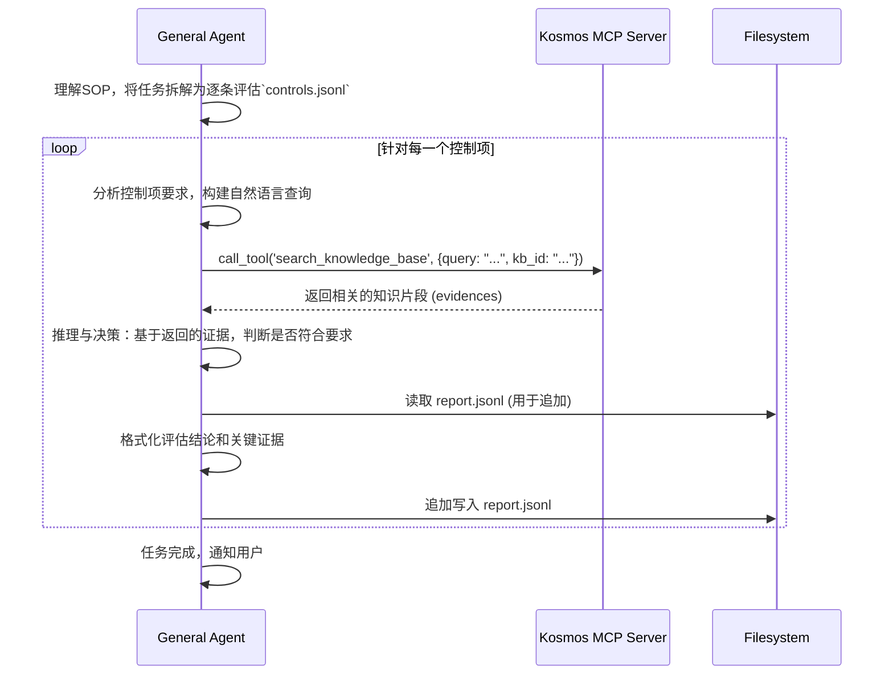

# 6. 赋能 Agent：Kosmos 作为 MCP 服务器

Kosmos 不仅仅是一个供人类使用的知识库，其更深远的价值在于作为**机器可读的记忆中枢**，为通用人工智能 Agent 提供长期、可靠、专业的知识支持。通过实现机器协作协议（MCP），Kosmos 能无缝地被任何兼容 MCP 的 Agent（如 Gemini CLI）作为工具调用，极大地增强了 Agent 执行复杂知识密集型任务的能力。

## MCP 集成：将知识库转化为 Agent 的工具

Kosmos 通过 `mcp/server.py` 脚本启动一个 MCP 服务器，该服务器将 Kosmos 的核心功能“工具化”，供 Agent 调用。

-   **工具化 (Tooling)**: `search_knowledge_base` 等核心服务被封装成一个标准的 MCP **Tool**。Agent 无需关心其内部复杂的 API 实现、认证流程或搜索管道，只需知道这个工具的名称、参数和作用即可。
-   **标准化接口**: Agent 通过标准的 MCP `call_tool` 请求来使用 Kosmos 的能力。这种标准化接口解耦了 Agent 与具体工具，使得 Agent 可以灵活地使用任何符合 MCP 规范的外部知识源或服务。

## 案例研究：Agent 执行网络安全评估

`mcp/trajectory.md` 文件完整记录了一次通用 Agent 利用 Kosmos 完成复杂网络安全评估任务的全过程。这个案例生动地展示了“Agent + Kosmos + 人类专家”三者结合所产生的强大合力。

### 任务背景

-   **Agent**: 一个通用的 Gemini CLI Agent。
-   **任务**: 根据一份《数据安全评估SOP》和一份包含数十个控制项的 `controls.jsonl` 文件，对菜鸟集团的数据安全状况进行评估。
-   **知识源**: 一个 Kosmos 知识库，其中包含了所有必要的评估证据（制度文档、系统截图、会议纪要等）。
-   **输出**: 一份结构化的评估报告 `assessment_report.jsonl`。

### Agent 的工作流程

1.  **任务拆解**: Agent 首先理解了宏观任务，并将其智能地分解为一系列针对单个控制项的、独立的子任务。例如，从评估“7.2.1.a 数据处理目的”开始。

2.  **知识获取**: 对于每个控制项，Agent 会：
    -   **构建查询**: 从控制项描述中提取核心关键词，形成一个自然语言查询（例如，`"数据处理目的 合同 业务说明"`）。
    -   **调用工具**: 调用 Kosmos 的 `search_knowledge_base` 工具。Kosmos 的语义搜索能力确保了返回的不仅仅是关键词匹配的结果，而是**语义相关**的证据片段。

3.  **推理与决策**: 这是最关键的一步。Agent 会仔细分析 Kosmos 返回的多个证据片段，并进行逻辑推理。
    -   例如，在评估“7.2.1.a”时，Agent 从返回的《数据处理协议》和数据清单中，成功推断出数据处理目的“合理、正当”且遵循“最小范围”原则，从而得出“符合”的结论。
    -   在评估“7.2.2.1.1.a 人员名单”时，尽管搜索到了“首席安全官”等角色证据，但并未找到包含具体联系方式的“名单”，因此 Agent 严谨地给出了“部分符合”的判断。

4.  **结果生成**: Agent 根据 SOP 中定义的 JSON 格式，将评估结论、评语和引用的关键证据 ID 及内容，格式化后写入报告文件。

## “三位一体”的协同优势

这个案例完美诠释了 Agent、Kosmos 和人类专家如何形成一个高效的智能体系统。

1.  **通用 Agent：强大的“执行大脑”**
    -   Agent 负责任务的**规划、拆解和执行**。它像一个项目经理，驱动整个评估流程，并能处理流程中的逻辑判断。

2.  **Kosmos：可靠的“外置记忆”**
    -   Kosmos 为 Agent 提供了**长期、稳定、专业**的知识支持。这解决了大型语言模型在面对专业领域知识时的两个核心痛点：
        -   **知识缺失**: Agent 无需在其内部参数中存储海量的专业知识。
        -   **幻觉问题**: 所有评估结论都基于从 Kosmos 中检索到的、可追溯的真实证据，确保了评估结果的**事实一致性**和**可靠性**。

3.  **人类专家设计的标签体系：画龙点睛的“领域知识”**
    -   在 `trajectory.md` 的搜索结果中，我们可以看到 `tags` 字段，如 `治理架构`, `专项管理制度`, `保密协议` 等。这些标签并非由 AI 随意生成，而是由**人类专家根据评估框架预先设计并加载到知识库的 `tag_dictionary` 中的**。
    -   **价值所在**:
        -   **提升知识质量**: 标签将非结构化的文本片段与结构化的领域概念关联起来，极大地提升了知识的**结构化程度**。
        -   **增强可解释性**: 当 Agent 看到一个片段被打上了“保密协议”的标签，它能更确信这个片段与“签署责任书”这一评估点相关。这为 Agent 的决策提供了更强的**可解释性**。
        -   **实现人机协作**: 标签体系是**人类专家知识的沉淀**。它允许专家将其领域经验和理解，以一种机器可读的方式注入到知识库中，从而指导和赋能 Agent，实现高效的人机协同。

综上所述，Kosmos 作为 MCP 服务器，不仅仅是 Agent 的一个工具，更是其能力的放大器。它将 Agent 的通用推理能力与特定领域的专业知识库相结合，并通过人类专家设计的标签体系进行引导，最终实现了高效、可靠、可解释的复杂任务自动化。
