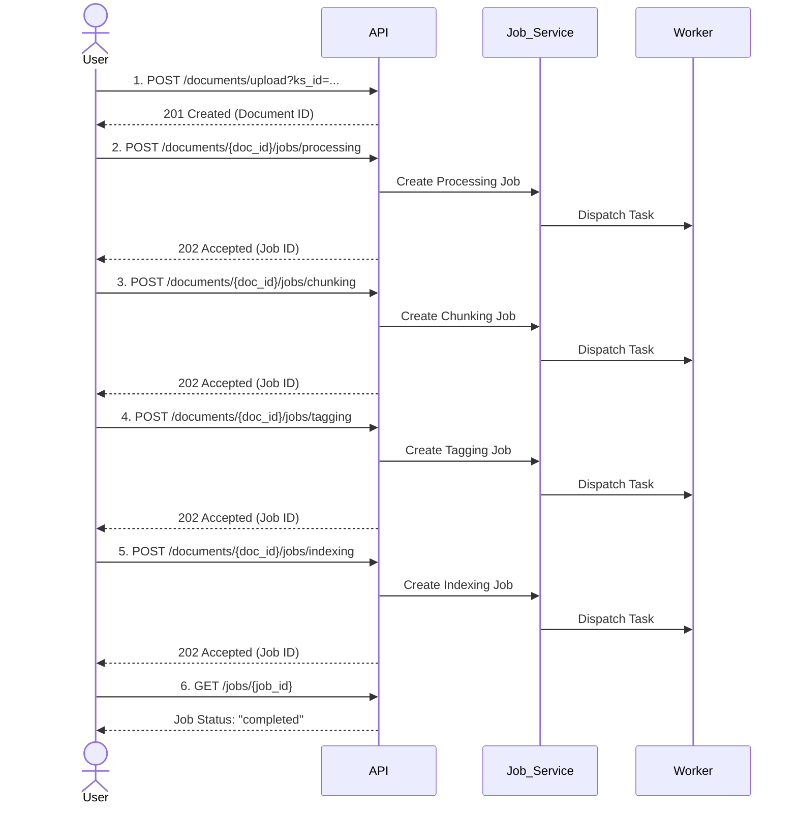

# 深入了解 Kosmos 知识库 (KB)

Kosmos KB 是一个通过 RESTful API 提供服务的、强大的知识处理与管理引擎。它的功能不是隐式的，而是通过定义清晰的API端点完全暴露出来的。理解这些API及其交互方式，是理解KB工作原理的关键。

## API驱动的核心概念

Kosmos KB 的核心实体均可通过API进行操作和管理：

*   **用户与凭证 (`/users`, `/credentials`)**: 用户是系统的基本单位。每个用户可以独立管理自己的AI模型凭证 (`ModelCredential`)，这些凭证被安全加密存储，并通过API进行增删改查。

*   **知识空间 (`/knowledge-spaces`)**: 知识的顶层容器和协作的基本单位。通过API可以创建知识空间、管理其成员和角色（`owner`, `editor`, `viewer`）。

*   **AI能力配置 (`/knowledge-spaces/{ks_id}/ai-configuration`, `/knowledge-spaces/{ks_id}/credentials`)**: 这是Kosmos最强大的功能之一。API允许将用户个人的AI凭证“链接”到特定的知识空间，并为其设置优先级和权重。这使得每个知识空间都可以拥有一个定制的、可路由的AI模型服务栈。

*   **文档与异步作业 (`/documents`, `/jobs`)**: 文档是知识的主要载体。`POST /documents/upload` API是知识摄入的入口。上传后，文档的处理由一个多阶段的、可独立触发的异步`Job`流水线驱动。

*   **内容读取与交互 (`/contents`, `/chunks`, `/assets`)**: 平台提供了丰富的API来消费处理好的知识。`/contents`端点支持按行号、百分比甚至书签（`@bookmark`）精确读取文本内容；`/assets`端点则用于获取文档中解析出的图片等资产及其VLM分析结果。

## 知识处理API工作流

与一个简单的“上传即处理”系统不同，Kosmos通过一系列专门的API端点，将复杂的文档处理流程分解为多个离散、可控的异步步骤。这为复杂的业务逻辑和重试、调试能力提供了坚实的基础。



这个流程清晰地表明，**文档上传**和**文档处理**是两个解耦的步骤，处理流水线中的每一步（文本化、分块、打标签、索引）都是一个独立的、可通过API启动和监控的`Job`。

## 动态演进的本体 (Ontology)

Kosmos的本体系统是“活”的，其演进机制也通过API暴露出来。

*   **后台生成**: 在`tagging`作业运行期间，系统可能会发现文档中的新概念，并自动创建本体变更提案 (`OntologyChangeProposal`)。
*   **人工审核**: 知识管理员通过调用 `GET /knowledge-spaces/{ks_id}/ontology/proposals` API来审查这些由AI生成的建议。
*   **API决策**: 管理员通过 `POST /ontology/proposals/{proposal_id}/approve` 或 `/reject` API来决定是否将这些变更合并到知识库的本体中。

这个“AI生成、人工审核”的闭环工作流，完全由API驱动，确保了知识库在不断吸收新知识的同时，其核心概念框架的质量和一致性也得到保证。

## 复杂的检索能力

`POST /search` 端点揭示了Kosmos强大的检索能力。其请求体支持：
*   **`query`**: 用户的自然语言查询。
*   **`filters`**: 基于元数据（如文档ID、标签）的精确过滤。
*   **`boosters`**: 影响相关性排序的软条件。

这表明其底层是一个混合检索系统，能够结合语义相似度、关键词匹配和结构化过滤，提供精准、可控的查询结果。
```