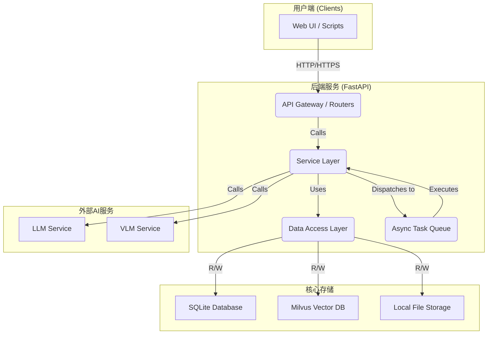

# KOSMOS - 整体架构设计 v2.0

## **1\. 核心理念**

Kosmos 的核心设计哲学是**神经-符号结合**。它利用大型语言模型（LLM）强大的**神经**直觉能力，并通过一个简洁、动态演化的**符号**系统（层次化标签字典）对其进行约束和引导。这一结合旨在解决领域知识的自动化构建、治理和应用难题，实现知识体系的“经验时间缩放”。

## **2\. 整体架构概览**

Kosmos采用前后端分离的现代Web应用架构，后端负责核心业务逻辑和数据处理，前端提供用户交互界面。



*   **后端 (FastAPI)**: 提供所有API接口，采用三层架构（Routers, Services, Repositories）实现逻辑解耦。
*   **异步任务队列 (AsyncTaskQueue)**: 使用`concurrent.futures.ThreadPoolExecutor`实现，处理所有耗时操作（如文档摄入、SDTM优化），确保API的快速响应。
*   **SQLite**: 存储所有结构化数据，包括用户信息、知识库元数据、文档信息、文本片段（Chunks）以及任务状态。
*   **Milvus**: 存储由文本片段生成的向量嵌入，并提供高效的向量检索和元数据过滤功能。
*   **本地文件存储**: 存储用户上传的原始文档，通过文件内容哈希实现去重。
*   **外部AI服务**: 调用LLM（如GPT系列）和VLM（视觉语言模型）API，用于标签生成、图片理解、SDTM分析等。

## **3\. 核心模块详解**

### **3.1 文档摄入 (Ingestion)**

这是将原始数据转化为可用知识的入口。

*   **异步流水线**: 由`IngestionService`编排，`AsyncTaskQueue`执行。
*   **统一化处理**: `ProcessorFactory`根据文件类型选择处理器。非PDF格式（如DOCX, PPTX）会先统一转换为PDF，再进行处理。
*   **双模态理解**: `PDFProcessor`是核心，它不仅提取文本，还对每页进行**截图**，并将截图与文本块关联。嵌入的图片会通过VLM进行理解，实现对文档内容和视觉版式的双重解析。
*   **原子化存储**: 最终产物是`Chunk`，一个包含文本、标签、向量和截图ID的独立知识单元，分别存入SQLite和Milvus。

### **3.2 SDTM (智能主题模型)**

SDTM是系统的认知核心，负责知识的自动化治理。

*   **双循环控制**:
    *   **外循环 (`SDTMService`)**: 编排业务流程，管理异步任务(`SDTMJob`)，从数据库获取批次，持久化结果。
    *   **内循环 (`SDTMEngine`)**: 与LLM交互，构建复���的Prompt（包含文档、当前字典、遥测数据），解析LLM返回的原子化编辑操作和文档标注。
*   **遥测驱动**: `SDTMStatsService`是系统的“传感器”，通过计算`QualityMetrics`（如“无法区分文档数”）和`ProgressMetrics`来量化知识库的“健康状况”，为LLM的优化决策提供数据支持。
*   **智能批处理**: `get_documents_to_process`方法采用优先级策略（**无法区分 > 错误 > 未标注 > 标注不足 > 正常**）构建处理批次，确保优先解决最关键的知识结构问题。
*   **三种运行模式**:
    *   **Edit**: 完全持久化，用于正式优化。
    *   **Annotate**: 仅持久化标注，用于在不改变结构的情况下分类新文档。
    *   **Shadow**: 不做任何持久化，用于评估和预览优化方案。

### **3.3 混合搜索 (Hybrid Search)**

`SearchService`实现了一个“**解析 -> 混合召回 -> 重排 -> 去重 -> 推荐**”的五阶段搜索流水线。

1.  **解析 (`QueryParser`)**: 将用户输入的复合查询（如`AI +技术 -历史 ~应用`）解析为结构化的查��对象。
2.  **混合召回 (`MilvusRepository`)**:
    *   **向量召回**: 基于查询文本的向量进行初步召回。
    *   **元数据过滤**: 同时利用Milvus的标量过滤能力，根据`+`和`-`标签精确筛选结果。
3.  **重排序 (`Reranker`)**: 根据`~`偏好标签，对召回结果进行加权打分和排序。
4.  **去重 (`Deduplicator`)**:
    *   **字面值去重**: 基于内容哈希。
    *   **语义去重**: 基于结果与查询的向量相似度分数，去除语义上高度重叠的结果。
5.  **推荐 (`TagRecommender`)**: 分析最终结果的标签分布，推荐可用于进一步探索的相关标签。

## **4. 数据模型 (SQLite ER图)**

```mermaid
erDiagram
    users {
        TEXT id PK
        TEXT username UK
        TEXT email UK
        TEXT password_hash
        TEXT role
        DATETIME created_at
        BOOLEAN is_active
    }

    knowledge_bases {
        TEXT id PK
        TEXT name
        TEXT description
        TEXT owner_id FK
        TEXT tag_dictionary JSON
        TEXT milvus_collection_id
        BOOLEAN is_public
        DATETIME last_tag_directory_update_time
        DATETIME created_at
    }

    kb_members {
        TEXT kb_id PK, FK
        TEXT user_id PK, FK
        TEXT role
        DATETIME created_at
    }

    physical_files {
        TEXT content_hash PK
        TEXT file_path UK
        INTEGER file_size
        INTEGER reference_count
        DATETIME created_at
    }

    documents {
        TEXT id PK
        TEXT content_hash FK
        TEXT filename
        TEXT file_type
        TEXT uploaded_by FK
        DATETIME created_at
    }

    kb_documents {
        TEXT kb_id PK, FK
        TEXT document_id PK, FK
        DATETIME upload_at
        DATETIME last_ingest_time
    }

    chunks {
        TEXT id PK
        TEXT kb_id FK
        TEXT document_id FK
        INTEGER chunk_index
        TEXT content
        TEXT tags JSON
        TEXT page_screenshot_ids JSON
        DATETIME created_at
    }

    page_screenshots {
        TEXT id PK
        TEXT document_id FK
        INTEGER page_number
        TEXT file_path
        INTEGER width
        INTEGER height
        DATETIME created_at
    }

    ingestion_jobs {
        TEXT id PK
        TEXT kb_id FK
        TEXT document_id FK
        TEXT task_id
        TEXT status
        TEXT error_message
        DATETIME created_at
        DATETIME updated_at
    }

    sdtm_jobs {
        TEXT id PK
        TEXT kb_id FK
        TEXT mode
        INTEGER batch_size
        BOOLEAN auto_apply
        TEXT status
        TEXT task_id
        TEXT error_message
        TEXT result JSON
        DATETIME created_at
        DATETIME updated_at
    }

    users ||--o{ knowledge_bases : "owns"
    users ||--|{ kb_members : "is_member_of"
    knowledge_bases ||--|{ kb_members : "has"
    knowledge_bases ||--o{ kb_documents : "contains"
    documents ||--o{ kb_documents : "is_part_of"
    documents }|--|| physical_files : "points_to"
    users ||--o{ documents : "uploaded"
    knowledge_bases ||--o{ chunks : "contains"
    documents ||--o{ chunks : "is_split_into"
    documents ||--o{ page_screenshots : "has"
    knowledge_bases ||--o{ ingestion_jobs : "has"
    documents ||--o{ ingestion_jobs : "is_for"
    knowledge_bases ||--o{ sdtm_jobs : "has"
```
