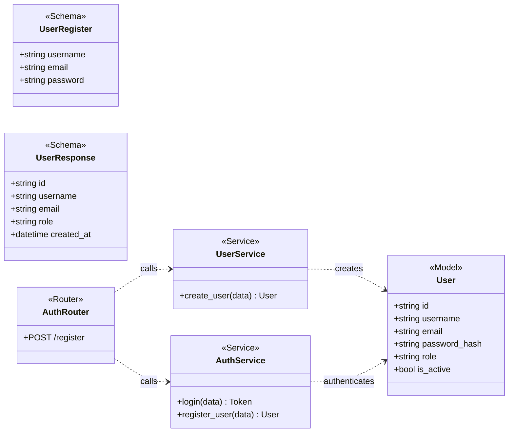
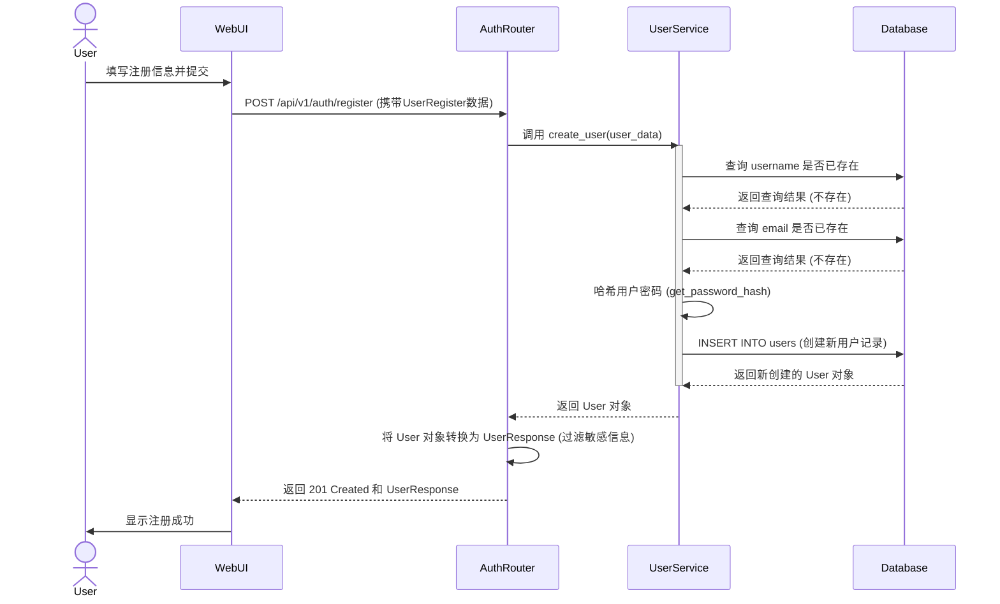

# 1. 用户注册流程

用户注册是任何用户与 Kosmos 系统交互的起点。该流程负责创建一个新的用户账户，并确保用户信息的唯一性和安全性。

## 核心类与模型

参与此流程的核心组件如下：

-   **AuthRouter**: 接收 `/api/v1/auth/register` 的 HTTP POST 请求。
-   **UserRegister (Schema)**: Pydantic 模型，用于验证和解析注册请求的 JSON body。
-   **UserService**: 包含创建用户的核心业务逻辑，如检查用户名和邮箱是否重复，以及密码哈希。
-   **User (Model)**: SQLAlchemy ORM 模型，对应数据库中的 `users` 表，用于持久化存储用户信息。
-   **UserResponse (Schema)**: Pydantic 模型，用于定义返回给客户端的用户信息，确保 `password_hash` 等敏感字段不会被泄露。

## 业务流程时序图

下面的时序图展示了从用户点击注册到收到成功响应的完整流程。

## 流程详解

1.  **用户提交**: 用户在前端界面填写用户名、邮箱和密码，然后点击“注册”。
2.  **API 请求**: 前端将用户填写的信息构造成一个 JSON 对象，向后端的 `/api/v1/auth/register` 端点发起 POST 请求。
3.  **路由处理**: `AuthRouter` 接收到请求。FastAPI 利用 `UserRegister` Pydantic 模型自动验证请求体，确保所有必填字段都存在且格式正确。
4.  **服务调用**: 路由层调用 `UserService` 的 `create_user` 方法，并将验证后的 `user_data` 传递过去。
5.  **业务逻辑执行**:
    -   `UserService` 首先会查询数据库，检查 `user_data` 中的 `username` 是否已经被其他用户注册。
    -   接着，它会再次查询数据库，检查 `email` 是否也已被注册。
    -   如果用户名或邮箱任何一个已存在，服务会抛出一个 `HTTPException`，该异常会被路由层捕获并返回一个 400 错误响应给客户端。
    -   如果检查通过，服务会调用 `get_password_hash` 函数对用户设置的明文密码进行哈希加密处理。**这是关键的安全步骤，确保数据库中不存储明文密码。**
6.  **数据持久化**: `UserService` 创建一个 `User` ORM 模型实例，将用户名、邮箱和哈希后的密码填充进去，然后通过数据库会话将其保存到 `users` 表中。
7.  **成功响应**:
    -   数据库操作成功后，`UserService` 将新创建的 `User` 对象返回给 `AuthRouter`。
    -   `AuthRouter` 根据 `response_model=UserResponse` 的定义，自动将 `User` 对象转换为 `UserResponse` 对象。这个过程会过滤掉 `password_hash` 等在响应模型中未定义的敏感字段。
    -   最终，路由层向客户端返回一个 `201 Created` 状态码和包含新用户基本信息的 JSON 响应。
8.  **前端反馈**: 前端收到成功的响应后，通常会提示用户“注册成功”，并可能引导用户前往登录页面。
