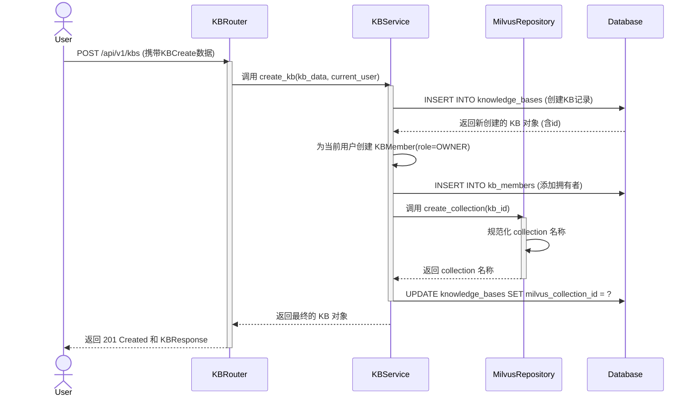
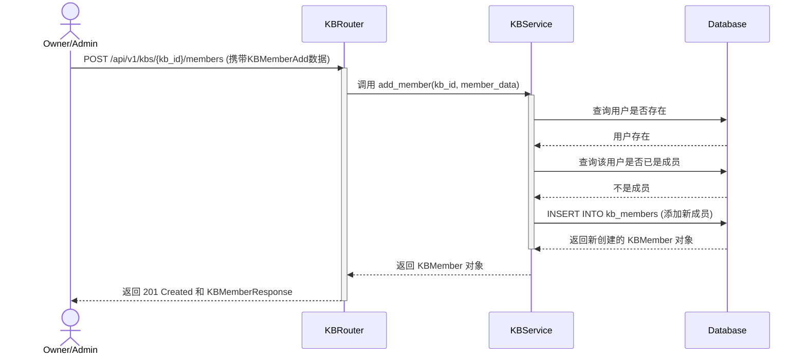

# 2. 知识库管理流程

知识库（Knowledge Base, KB）是 Kosmos 中最顶层的组织单元。所有的数据和操作都在一个特定的知识库内进行。本节将描述与知识库生命周期相关的核心流程，包括创建、更新、删除和成员管理。

## 核心类与模型

```mermaid
classDiagram
    direction RL

    class KBCreate {
        <<Schema>>
        +string name
        +string description
        +bool is_public
    }

    class KBResponse {
        <<Schema>>
        +string id
        +string name
        +string description
        +string owner_id
    }

    class KBMemberAdd {
        <<Schema>>
        +string user_id
        +KBRole role
    }

    class KnowledgeBase {
        <<Model>>
        +string id
        +string name
        +string owner_id
    }

    class KBMember {
        <<Model>>
        +string kb_id
        +string user_id
        +KBRole role
    }

    class KBService {
        <<Service>>
        +create_kb(data, user) KnowledgeBase
        +update_kb(kb_id, data) KnowledgeBase
        +delete_kb(kb_id) bool
        +add_member(kb_id, data) KBMember
        +remove_member(kb_id, user_id) bool
    }

    class KBRouter {
        <<Router>>
        +POST /kbs
        +PUT /kbs/{kb_id}
        +DELETE /kbs/{kb_id}
        +POST /kbs/{kb_id}/members
    }

    KBRouter ..> KBService : calls
    KBService ..> KnowledgeBase : manages
    KBService ..> KBMember : manages
```

-   **KBRouter**: 提供了用于创建、更新、删除知识库以及管理其成员的 API 端点。
-   **KBCreate (Schema)**: 定义了创建一个新知识库所需的输入数据。
-   **KBService**: 封装了所有与知识库相关的业务逻辑。这是管理流程的核心。
-   **KnowledgeBase (Model)**: 对应数据库中的 `knowledge_bases` 表，存储知识库的元数据。
-   **KBMember (Model)**: 关联表，记录了用户与知识库之间的成员关系和角色（如 `OWNER`, `ADMIN`, `MEMBER`）。

## 业务流程时序图

### 1. 创建知识库



**流程详解**:
1.  **API 调用**: 用户通过前端提交创建知识库的表单，触发对 `POST /api/v1/kbs` 的调用。
2.  **服务处理**: `KBService` 接收到请求后，首先在 PostgreSQL 中创建一个 `KnowledgeBase` 记录。
3.  **设置所有者**: `KBService` 立即为当前用户创建一个 `KBMember` 记录，并将其角色设置为 `OWNER`，确保每个知识库都有一位所有者。
4.  **创建向量集合**: `KBService` 调用 `MilvusRepository` 的 `create_collection` 方法。仓库层会根据知识库 ID 生成一个唯一的、符合 Milvus 命名规范的 Collection 名称，并在 Milvus 中创建一个新的 Collection，用于存放该知识库的向量数据。
5.  **更新记录**: 创建成功后，`KBService` 将 Milvus 返回的 Collection 名称更新到 PostgreSQL 的 `KnowledgeBase` 记录中。
6.  **返回结果**: 最后，将创建好的知识库信息返回给用户。

### 2. 添加知识库成员



**流程详解**:
1.  **权限验证**: `KBRouter` 首先会通过依赖注入验证当前用户是否是该知识库的 `ADMIN` 或 `OWNER`，如果不是，则直接拒绝请求。
2.  **服务处理**: `KBService` 检查被邀请的用户是否存在，以及是否已经是该知识库的成员。
3.  **数据持久化**: 如果一切正常，`KBService` 会在 `kb_members` 表中创建一条新的记录，将指定用户以指定角色添加到知识库中。如果用户已是成员，则会更新其角色。

### 3. 删除知识库

删除知识库是一个级联操作，需要清理所有相关资源，以避免产生孤立数据。

**流程详解**:
1.  **权限验证**: `KBRouter` 验证当前用户是否是知识库的 `OWNER`。只有所有者才能删除知识库。
2.  **服务处理**: `KBService` 的 `delete_kb` 方法被调用。
3.  **清理向量数据**: `KBService` 首先调用 `MilvusRepository` 删除与该知识库关联的整个 Milvus Collection。
4.  **清理数据库记录**:
    -   删除所有与该知识库相关的**任务记录** (`jobs`, `tasks`)。
    -   删除所有**关联关系**，如 `kb_fragments`, `kb_documents`。
    -   删除所有**索引记录** (`indexes`)。
    -   删除**模型配置** (`kb_model_configs`)。
    -   最后，删除 `knowledge_bases` 表中的主记录。与之关联的 `kb_members` 记录会因为数据库的级联删除（`ondelete="CASCADE"`）而被自动清理。
5.  **返回结果**: 操作成功后，向客户端返回 `204 No Content` 响应。
