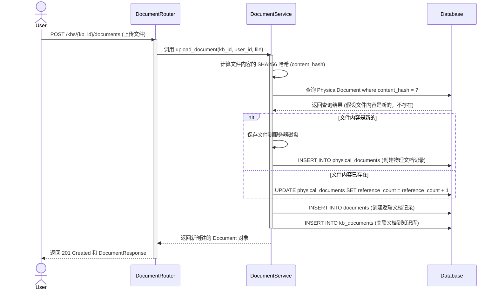
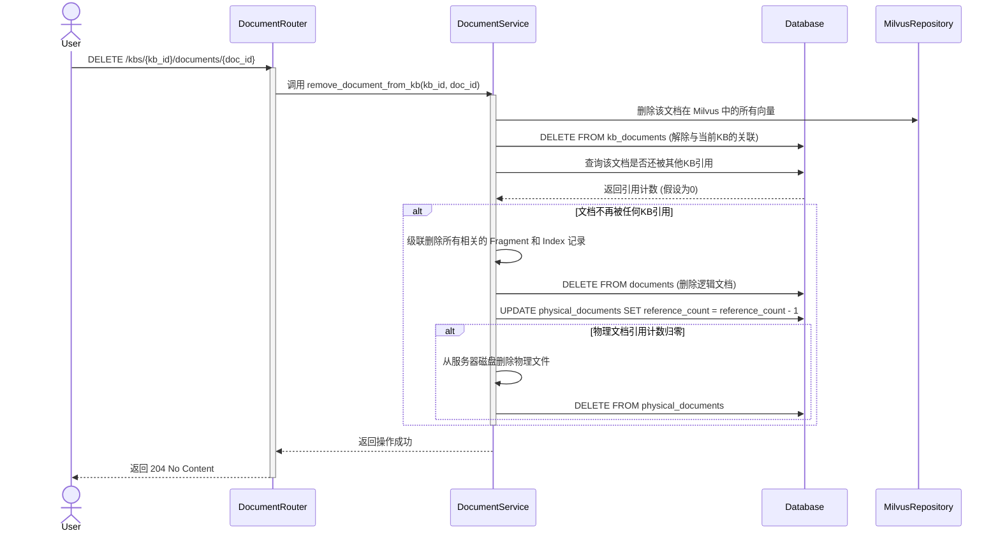

# 3. 文档管理流程

文档是知识库中知识的原始载体。本文档描述了与文档相关的核心操作：上传、下载和删除，并深入解释了 Kosmos独特的逻辑文档与物理文档分离的设计。

## 核心类与模型

```mermaid
classDiagram
    direction RL

    class Document {
        <<Model>>
        +string id
        +string filename
        +string content_hash
    }

    class PhysicalDocument {
        <<Model>>
        +string content_hash
        +int file_size
        +string url
        +int reference_count
    }

    class KBDocument {
        <<Model>>
        +string kb_id
        +string document_id
    }

    class DocumentService {
        <<Service>>
        +upload_document(kb_id, user_id, file) Document
        +remove_document_from_kb(kb_id, doc_id) bool
        +get_document_file_path(doc_id) string
    }

    class DocumentRouter {
        <<Router>>
        +POST /kbs/{kb_id}/documents
        +GET /kbs/{kb_id}/documents/{doc_id}/download
        +DELETE /kbs/{kb_id}/documents/{doc_id}
    }

    DocumentRouter ..> DocumentService : calls
    DocumentService ..> Document : manages
    DocumentService ..> PhysicalDocument : manages
    DocumentService ..> KBDocument : manages
    Document "1" -- "1" PhysicalDocument : points to
    KBDocument "1" -- "1" Document : links
```

-   **DocumentRouter**: 提供文档上传、下载、删除等 API 端点。
-   **DocumentService**: 封装了所有文档管理的业务逻辑，是本流程的核心。
-   **Document (Model)**: **逻辑文档**，代表一次上传事件。
-   **PhysicalDocument (Model)**: **物理文档**，代表一个唯一的文件内容。
-   **KBDocument (Model)**: 关联表，用于将一个逻辑文档链接到一个或多个知识库。

## 业务流程时序图

### 1. 上传文档



### 2. 删除文档



## 核心设计：逻辑文档与物理文档分离

这是 Kosmos 在文档管理上的一个核心设计，旨在实现高效的存储和数据完整性。

### 定义

-   **逻辑文档 (Document)**:
    -   **它是什么**: 一次**上传行为**的记录。
    -   **它关心什么**: “谁在什么时间上传了哪个文件到哪个知识库”。
    -   **生命周期**: 当用户在某个知识库中删除一个文档时，被删除的是逻辑文档与该知识库的**关联** (`KBDocument` 记录)。如果该逻辑文档不再被任何知识库引用，那么这个逻辑文档记录本身才会被删除。

-   **物理文档 (PhysicalDocument)**:
    -   **它是什么**: 一个**唯一的文件内容**。
    -   **它关心什么**: “这个文件内容是什么，它被多少次上传行为所引用”。
    -   **唯一性**: 通过文件内容的 SHA256 哈希值作为主键，确保了相同内容的文件在系统中只存储一份。
    -   **生命周期**: 只有当其 `reference_count`（引用计数）减为 0 时，这个物理文件及其在服务器上的实体才会被删除。

### 价值与优势

1.  **存储空间优化**: 这是最直接的好处。如果多个用户、多个团队在不同的知识库中上传了同一份行业报告、技术规范或公司模板，这份文件在服务器上只会占用一份存储空间。对于动辄上百兆的 PDF 或 PPT 文件，这种优化效果非常显著。

2.  **数据完整性**: 通过引用计数，系统可以安全地判断一个物理文件是否可以被删除，避免了“误删”导致其他知识库的文档失效的问题。

3.  **上传效率提升**: 当用户上传一个已经存在于系统中的文件时，后端只需计算一次哈希值，在数据库中比对成功后，即可完成大部分操作（增加引用计数、创建逻辑文档关联），无需再次进行文件的磁盘 I/O，加快了上传流程。

4.  **内容去重的前置基础**: 这种基于内容哈希的管理方式，为后续更高级的语义去重、版本控制等功能打下了坚实的基础。
