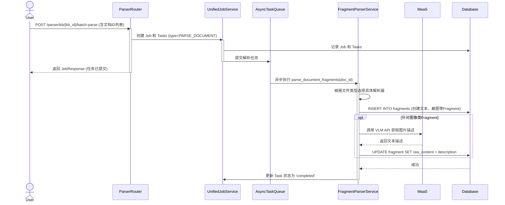
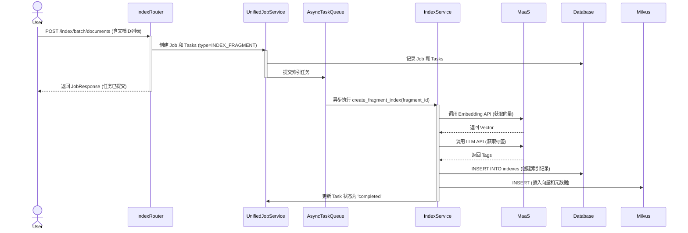

# 4. 文档摄入流程：解析与索引

文档上传后，并不能立即被搜索到。它必须经过一个“摄入”（Ingestion）流程，将其从原始的、非结构化的文件格式，转化为系统可以理解和检索的结构化知识。这个流程主要分为两个核心阶段：**解析 (Parsing)** 和 **索引 (Indexing)**。

## 核心类与模型

```mermaid
classDiagram
    direction LR

    class Document {
        <<Model>>
        +string id
    }

    class Fragment {
        <<Model>>
        +string id
        +string fragment_type
        +string raw_content
    }

    class Index {
        <<Model>>
        +string id
        +list~string~ tags
    }

    class UnifiedJobService {
        <<Service>>
        +submit_job(job, tasks)
    }

    class FragmentParserService {
        <<Service>>
        +parse_document_fragments(doc_id)
    }

    class IndexService {
        <<Service>>
        +create_fragment_index(fragment_id)
    }

    class ParserRouter {
        <<Router>>
        +POST /parser/kb/{kb_id}/batch-parse
    }

    class IndexRouter {
        <<Router>>
        +POST /index/batch/documents
    }

    ParserRouter ..> UnifiedJobService : creates Parse job
    IndexRouter ..> UnifiedJobService : creates Index job
    UnifiedJobService ..> FragmentParserService : executes parse task
    UnifiedJobService ..> IndexService : executes index task

    FragmentParserService ..> Fragment : creates
    FragmentParserService ..> MaaS : calls VLM
    IndexService ..> Index : creates
    IndexService ..> MilvusRepository : inserts vector
```

-   **UnifiedJobService**: 统一任务服务，负责接收并调度耗时的解析和索引任务，实现异步处理。
-   **FragmentParserService**: 解析服务的核心，负责调用具体的解析器（如 PDF 解析器）将文档分解为多个 `Fragment`，并调用 VLM 理解图像内容。
-   **IndexService**: 索引服务的核心，负责为文本 `Fragment` 生成标签和向量嵌入，并创建 `Index` 记录。

## 业务流程时序图

由于解析和索引是独立的异步任务，我们分别展示它们的时序图。

### 1. 解析流程 (Parsing)



### 2. 索引流程 (Indexing)



## 核心概念辨析：解析 vs. 索引

虽然解析和索引都是文档摄入的一部分，但它们是两个目标和过程完全不同的阶段。

### 解析 (Parsing)

-   **目标**: **结构化与多模态理解**。将一个完整的、非结构化的文档分解成一系列系统可以理解的、有意义的最小知识单元（`Fragment`），并利用 VLM 让系统“读懂”图片。
-   **过程**:
    1.  **选择解析器**: 系统根据文件的类型（`.pdf`, `.docx` 等）选择一个专门的解析器。
    2.  **内容分解**: 解析器读取文件内容，并根据其内部结构（如段落、标题、图片、表格）将其切分成多个片段。
    3.  **视觉内容理解 (VLM)**: 对于 `screenshot` 或 `figure` 类型的片段，系统会调用外部的**视觉语言模型 (VLM)**。VLM 会分析图片内容，并生成一段描述性的文本（例如，“一个包含用户名和密码输入框的登录表单”）。这段文本随后会被存入对应 `Fragment` 的 `raw_content` 字段。
    4.  **元数据提取**: 在分解过程中，解析器会为每个片段提取丰富的元数据，例如它在原始文档中的**页码**、**位置坐标**等。
-   **产出**: 一系列的 `Fragment` 记录。其中，文本片段直接包含了原文，而**图像片段则包含了由 VLM 生成的文本描述**。这使得非文本内容也具备了可被索引的基础。

### 索引 (Indexing)

-   **目标**: **可检索化**。让知识（包括由 VLM 从图片中提取的文本知识）能够通过语义和标签被快速、准确地找到。
-   **过程**:
    1.  **对象**: 索引过程只针对**包含文本内容 的 `Fragment`**。这既包括原始的文本片段，也包括那些 `raw_content` 已被 VLM 填充了文本描述的图像片段。
    2.  **向量化**: 调用外部的 **Embedding 模型**，将片段的 `raw_content` 转换成一个高维数学向量（Embedding）。
    3.  **标签化**: 调用外部的 **LLM**，结合知识库预定义的 `tag_dictionary` 和文本内容，智能地生成一组最相关的标签。
    4.  **数据持久化**:
        -   生成的**向量**与 `fragment_id` 等信息被存入 **Milvus** 向量数据库。
        -   生成的**标签**与 `fragment_id` 等信息被存入 PostgreSQL 的 `indexes` 表中。
-   **产出**: 一个可被搜索的 `Index` 记录和其在 Milvus 中的向量。只有经过索引的 `Fragment` 才能在语义搜索中被召回。

### 总结

| 特性     | 解析 (Parsing)                               | 索引 (Indexing)                                |
| :------- | :------------------------------------------- | :--------------------------------------------- |
| **输入** | 整个 `Document` 文件                         | 单个包含文本内容的 `Fragment`                  |
| **目标** | 将文档**结构化**并**理解视觉内容**           | 让文本片段**可被检索**                         |
| **产出** | 多个 `Fragment` (文本片段直接含原文，图像片段含VLM描述) | 一个 `Index` 记录 (含标签) 和一个 Milvus 向量  |
| **核心技术** | 文件格式解析、布局分析、**视觉语言模型 (VLM)** | 自然语言处理 (NLP)、Embedding、大语言模型 (LLM) |
| **解决的问题** | “这个文档里有什么内容，图片讲了什么？”         | “如何根据含义或标签快速找到这段内容？”         |

---

## 深度解析

为了更深入地了解不同类型文件（纯文本、独立图像、PDF等）的具体解析策略和流程，请参阅：

-   **[4a. 深度解析：Parser 的工作原理](./4a_parser_deep_dive.md)**

