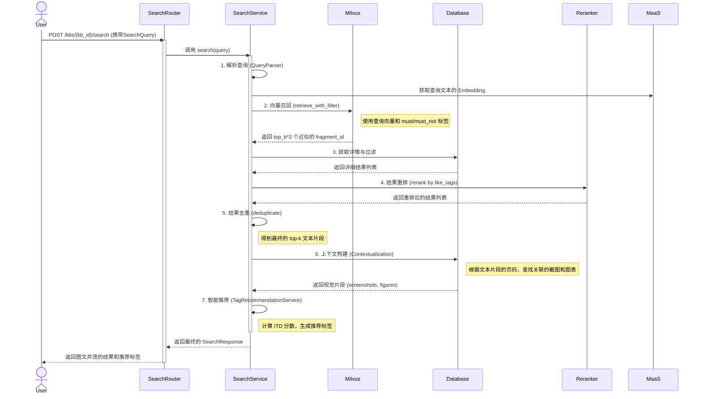

# 5. 语义搜索流程

语义搜索是 Kosmos 系统的核心价值所在。它超越了传统的关键词匹配，能够理解用户的查询意图，并从知识库中找到含义最相关的内容。整个搜索流程是一个精心设计的多阶段管道，旨在平衡召回率、精确率和响应速度，并提供丰富的上下文和智能引导。

## 核心类与模型

```mermaid
classDiagram
    direction LR

    class SearchQuery {
        <<Schema>>
        +string query
        +int top_k
        +list~string~ must_tags
        +list~string~ must_not_tags
        +list~string~ like_tags
        +bool include_screenshots
        +bool include_figures
    }

    class SearchService {
        <<Service>>
        +search(query) SearchResponse
    }

    class TagRecommendationService {
        <<Service>>
        +generate_recommendations(results) list
    }

    class QueryParser { <<Util>> }
    class Reranker { <<Util>> }
    class Deduplicator { <<Util>> }

    class SearchRouter {
        <<Router>>
        +POST /kbs/{kb_id}/search
    }

    SearchRouter ..> SearchService : calls
    SearchService ..> QueryParser : uses
    SearchService ..> MilvusRepository : retrieves from
    SearchService ..> Reranker : uses
    SearchService ..> Deduplicator : uses
    SearchService ..> TagRecommendationService : uses
```

## 业务流程时序图



## 搜索管道 (Search Pipeline) 详解

Kosmos 的搜索流程被设计为一个包含七个阶段的精密管道：

### 阶段一：查询解析 (Query Parsing)

-   **目标**: 理解用户的完整查询意图。
-   **过程**: `QueryParser` 工具类解析用户输入的字符串，分离出核心**搜索文本**和**标签指令**（`+` 表示 `must_tags`, `-` 表示 `must_not_tags`, `~` 表示 `like_tags`）。

### 阶段二：召回 (Recall)

-   **目标**: **快速、广泛地**从海量数据中找出所有可能相关的候选内容。
-   **过程**: `SearchService` 将解析出的搜索文本向量化后，在 Milvus 中执行**近似最近邻搜索**，同时利用 `must_tags` 和 `must_not_tags` 进行元数据预过滤。
-   **价值**: 高效、语义相关，并能通过硬性标签初步聚焦范围。

### 阶段三：过滤 (Filtering)

-   **目标**: **精确化**并补全信息。
-   **过程**: 根据 Milvus 返回的 `fragment_id` 列表，从 PostgreSQL 中获取这些片段的完整信息（原文、所有标签、元数据等）。

### 阶段四：重排 (Reranking)

-   **目标**: **个性化与可控性**。
-   **过程**: `Reranker` 工具类根据用户指定的 `like_tags`（偏好标签）为结果列表重新排序。包含偏好标签越多的结果，得分越高，排名越靠前。
-   **价值**: 赋予用户对搜索结果排序的**控制力**和**可解释性**，解决了纯向量搜索结果有时过于发散的问题。

### 阶段五：去重 (Deduplication)

-   **目标**: 提升信息密度。
-   **过程**: `Deduplicator` 工具类移除内容或语义上高度重复的结果。

### 阶段六：上下文构建 (Contextualization)

-   **目标**: **提供视觉上下文，还原知识场景**。
-   **过程**: 这是将文本结果转化为图文并茂答案的关键一步。
    1.  对于进入最终列表的每一个 `text` 片段，`SearchService` 会检查其 `meta_info` 中记录的页码范围（`page_start`, `page_end`）。
    2.  然后，服务会**反向查询**数据库，寻找来自**同一文档**、且页面范围与该文本片段**重叠**的 `screenshot`（截图）和 `figure`（图表）类型的片段。
    3.  这些找到的视觉片段会被自动关联到对应的文本片段上，一同返回给前端。
-   **价值**:
    -   **还原场景**: 用户不仅能看到相关的文本描述，还能立刻看到这段描述所对应的原始页面截图或数据图表，极大地增强了对知识的理解和信任。
    -   **知识的完整性**: 它将文档解析阶段分离出的不同模态的 `Fragment`，在用户最需要的时候重新聚合起来，提供了远超纯文本的完整知识体验。

### 阶段七：智能推荐 (Tag Recommendation)

-   **目标**: **启发式引导**，帮助用户进行更深入、更精准的二次探索。
-   **过程**: `TagRecommendationService` 分析最终结果集中的标签分布，推荐出最相关且最具区分度的标签。
-   **核心算法：ITD (Inverse Tag Density)**
    -   这个算法的思想类似于搜索领域的 TF-IDF。它旨在找到那些在**当前搜索结果中频繁出现（TF高）**，但在**整个知识库中又相对稀有（ITD高）**的标签。
    -   **TF (Tag Frequency)**: 计算一个标签在当前 top-k 结果中出现的频率。
    -   **ITD (Inverse Tag Density)**: 计算一个标签在整个知识库中的稀有度。公式为 `log(知识库中的总片段数 / 包含该标签的片段数)`。一个在所有文档中都出现的通用标签（如“公司内部”），其 ITD 值会很低；而一个专业性强的标签（如“数据加密存储”），其 ITD 值会很高。
    -   **最终得分**: `Score(tag) = TF(tag) * ITD(tag)`。
-   **价值**:
    -   **避免通用推荐**: ITD 机制能有效过滤掉那些过于宽泛、对缩小搜索范围没有帮助的标签。
    -   **智能导航**: 推荐出的标签往往是当前主题下最具代表性的**子主题**或**关键切面**，能极大地启发用户，引导他们发现之前未曾想到的关联知识，从而优化查询，快速收敛到目标信息。

