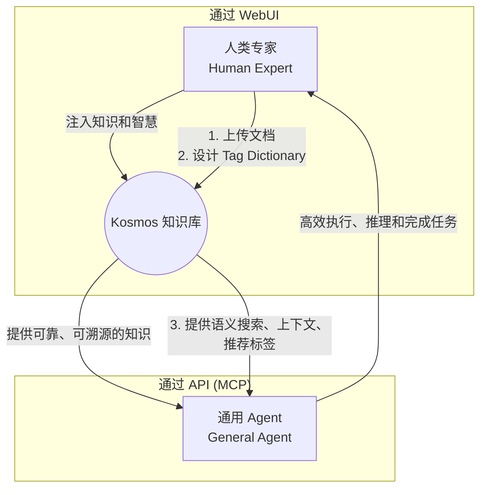

# 0. 设计哲学与产品定位

在深入了解 Kosmos 的技术架构和功能之前，理解其背后的设计哲学至关重要。这份文档阐述了指导 Kosmos 开发的核心思想，它解释了系统中许多设计决策背后的“为什么”。

## 核心定位：赋能而非自动化

Kosmos 的根本定位是一种**“赋能 (Empowerment)”**技术，而非**“自动化 (Automation)”**技术。

-   **自动化技术**旨在**替代**人类。它通常接收标准输入，通过一个黑箱流程，产出一个终结性的、最优的答案。
-   **赋能技术**旨在**增强**人类或 Agent 的能力。它提供丰富的协作接口和透明的处理过程，输出一个富含上下文和可能性的决策支持包，帮助使用者做出更明智的最终判断。

Kosmos 的每一个功能都体现了“赋能”的理念：
-   **`tag_dictionary`**: 赋能领域专家，让他们将自己的领域知识“立法”到系统中。
-   **`like_tags` 与上下文构建**: 赋能知识用户，让他们成为搜索的“驾驶者”，并结合完整的场景进行判断。
-   **MCP 工具集**: 赋能 AI Agent，为其提供一个可靠的“外置记忆体”，放大其解决复杂问题的能力。

## 核心战略：Agent 优先 (Agent-First)

如果说“赋能”是战术焦点，那么“Agent 优先”就是 Kosmos 的战略定位。这意味着，系统的最终目标是成为通用 Agent 生态中一个可插拔的、可靠的**长期记忆模块**。

这个战略决定了系统两大支柱的设计。

### 支柱一：API 即产品 (API as the Product)

在“Agent 优先”的框架下，API 是核心产品，其主要用户是机器（Agent）。

-   **为机器设计的接口**: `SearchQuery` Schema 允许 Agent 构建包含多种指令（自然语言、硬性过滤、软性偏好）的精密查询。
-   **为机器设计的响应**: API 返回的 `SearchResult` 是高度结构化的，包含了 `fragment_id`, `document_id`, `tags`, `meta_info` 等丰富的元数据。这些元数据是 Agent 实现**知识追溯**、**事实核查**和**跨模态推理**的生命线。
-   **标准化的封装**: `mcp/server.py` 将 Kosmos 的能力封装成标准的 MCP 工具，使其能被任何通用 Agent 即插即用。

### 支柱二：WebUI 的战略辅助角色

WebUI 并非 API 的附属品，而是**人机协作（Human-in-the-Loop）的关键接口**，扮演着三个战略性角色：

1.  **知识的“写入”接口**: 人类专家通过 WebUI 将高质量的、非公开的领域知识（文档）**注入**到 Kosmos 这个“外置大脑”中。
2.  **知识质量的“校准”工具**: 专家通过 WebUI 的“召回测试”等功能，迭代优化 `tag_dictionary`，相当于在**校准和训练** Agent 的这个“外置大脑”，确保其知识的准确性和可用性。
3.  **操作的“安全阀”**: 高风险、不可逆的操作（如删除知识库）被保留在 WebUI 中，需要人类确认。这确保了 Agent 在高效执行任务的同时，系统的整体安全可控。

## 最终形态：黄金三角协作模式

Kosmos 的设计最终促成了一个高效的“Agent + Kosmos + 专家”黄金三角协作模式。

1.  **人类专家 (引导者)**: 通过 WebUI **注入高质量的知识**（上传文档）和**注入领域智慧**（设计 `tag_dictionary`）。他们是知识库的**架构师**。
2.  **Kosmos (记忆体)**: 作为可靠的**事实基础**和**记忆中枢**，连接专家智慧与 Agent 的执行能力。
3.  **通用 Agent (执行者)**: 作为任务的**驱动核心**，负责规划、拆解、推理，并利用 Kosmos 提供的知识高效完成任务。

在这个模型中，`tag_dictionary` 成为**人类专家知识的结晶**，它以一种机器可读的方式，将人类的经验和抽象思考能力，赋能给 Agent，实现了 `1+1+1 > 3` 的协同效应。

综上，Kosmos 的设计哲学旨在构建一个与 AI Agent 深度协同的、可编程的知识基础设施，其核心是实现人类智慧与机器智能的**共生 (Symbiosis)**，而非替代。
