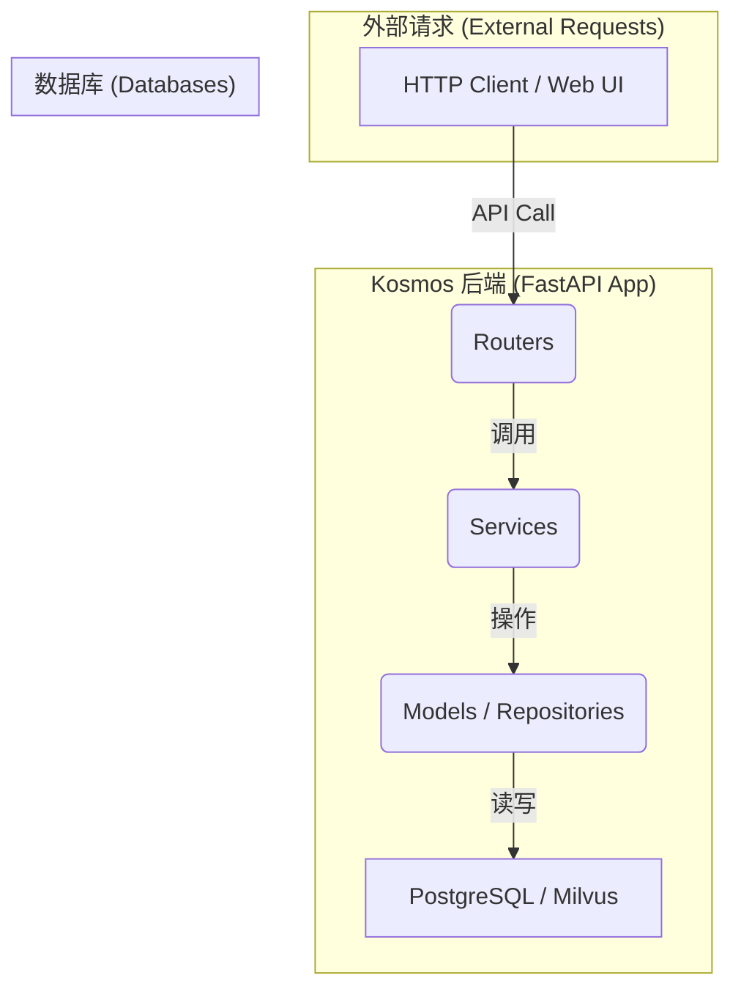

# 2. 后端分层架构

Kosmos 后端遵循经典的三层架构设计，确保了代码的清晰、可维护性和可扩展性。这种分层方法将不同职责的代码分离到独立的模块中，使得每一层都可以独立地进行修改和测试。

## 各层职责详解

### 1. Routers (路由层)

-   **位置**: `app/routers/`
-   **职责**:
    -   **API 入口**: 定义所有对外暴露的 HTTP API 端点（Endpoint），例如 `/api/v1/kbs`, `/api/v1/documents` 等。
    -   **请求解析与验证**: 使用 FastAPI 的依赖注入和 Pydantic 模型，自动解析和验证传入的请求数据（如请求体、查询参数）。
    -   **依赖注入**: 负责注入核心依赖，如数据库会话 (`get_db`) 和用户认证信息 (`get_current_user`)。
    -   **调用服务层**: 将通过验证的请求数据传递给相应的服务层（Service）进行业务逻辑处理。
    -   **构建响应**: 从服务层获取处理结果，并将其构造成标准的 HTTP 响应（通常是 JSON 格式）返回给客户端。
-   **特点**: 路由层非常“薄”，它不包含任何复杂的业务逻辑，主要负责请求的接收和转发，充当“交通警察”的角色。

### 2. Services (服务层)

-   **位置**: `app/services/`
-   **职责**:
    -   **核心业务逻辑**: 实现系统中所有的业务规则和操作流程。例如，`DocumentService` 中的 `upload_document` 方法包含了计算文件哈希、创建物理文档和逻辑文档记录、建立知识库关联等一系列操作。
    -   **逻辑编排**: 当一个操作需要跨越多个数据模型或外部服务时，服务层负责编排这些调用。例如，`IndexService` 在创建索引时，需要调用 `CredentialService` 获取模型凭证，调用外部 AI 模型生成向量，然后将结果分别存入 PostgreSQL 和 Milvus。
    -   **事务管理**: 虽然数据库会话由 `get_db` 提供，但服务层是决定事务边界（何时提交、何时回滚）的地方。
    -   **异常处理**: 捕获并处理业务逻辑执行过程中的特定异常，或将其包装后抛出给路由层。
-   **特点**: 服务层是系统的“大脑”，包含了大部分的复杂逻辑。

### 3. Models & Repositories (模型与仓库层)

-   **位置**: `app/models/` 和 `app/repositories/`
-   **职责**:
    -   **Models (模型层)**:
        -   **数据结构定义**: 使用 SQLAlchemy ORM，将 Python 类映射到数据库中的表结构。例如，`UserModel` 类定义了 `users` 表的列和关系。
        -   **数据关系**: 定义不同模型之间的关系，如一对多、多对多（例如 `KnowledgeBase` 和 `User` 之间的 `KBMember` 关联表）。
    -   **Repositories (仓库层)**:
        -   **数据访问抽象**: 封装了对特定数据库（尤其是 Milvus）的直接操作。例如，`MilvusRepository` 封装了创建 Collection、插入向量、执行向量搜索等所有与 Milvus 相关的底层交互。
        -   **关注点分离**: 将数据持久化的具体实现方式（如使用哪个数据库、如何构建查询）与服务层的业务逻辑分离开。这使得未来如果需要更换数据库（例如从 Milvus 更换为其他向量数据库），主要修改的将是仓库层，而对服务层的影响较小。
-   **特点**: 这一层是系统与数据持久化存储之间的桥梁，提供了清晰的数据结构定义和统一的数据访问接口。

## 数据流示例：上传文档

1.  **请求**: 用户通过 Web UI 上传一个文件，前端向 `/api/v1/kbs/{kb_id}/documents` 发送一个 `POST` 请求。
2.  **路由层**: `routers/documents.py` 中的 `upload_document` 端点接收到请求。它通过依赖注入获取了数据库会话、当前用户信息以及知识库的访问权限。
3.  **服务层**: 路由层调用 `services/document_service.py` 中的 `upload_document` 方法，并传入文件内容和元数据。
4.  **模型/仓库层**:
    -   `DocumentService` 计算文件哈希，查询 `PhysicalDocument` 模型，看文件是否已存在。
    -   如果不存在，它将文件保存到本地，并创建一个新的 `PhysicalDocument` 记录和一个 `Document` 记录。
    -   最后，它创建一个 `KBDocument` 记录，将文档与知识库关联起来。
5.  **响应**: `DocumentService` 将新创建的 `Document` 对象返回给路由层，路由层再将其序列化为 JSON，作为 HTTP 201 响应返回给前端。
