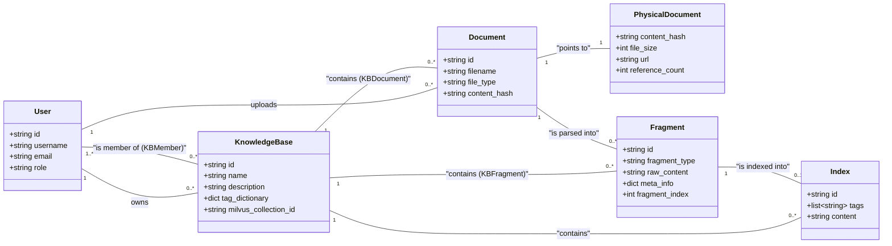

# 3. 核心概念与数据模型

Kosmos 的强大功能构建在一组清晰且相互关联的核心概念之上。理解这些概念及其背后的数据模型，是掌握系统工作原理的关键。

## 概念详解

### 1. 用户 (User)

-   **描述**: 代表系统的操作者。用户可以拥有知识库、成为知识库成员、上传文档等。
-   **关键属性**:
    -   `id`: 用户的唯一标识。
    -   `username`, `email`: 用于登录和识别。
    -   `role`: 角色（如 `user`, `admin`, `system_admin`），决定了用户的操作权限。

### 2. 知识库 (KnowledgeBase)

-   **描述**: 知识的顶层容器，是一个独立、隔离的工作空间。
-   **关键属性**:
    -   `name`, `description`: 知识库的基本信息。
    -   `owner_id`: 指向拥有该知识库的 `User`。
    -   `tag_dictionary`: 一个 JSON 字段，存储了该知识库特有的、层级化的标签体系，用于指导后续的自动标签生成和搜索筛选。
    -   `milvus_collection_id`: 对应在 Milvus 向量数据库中创建的 Collection 的名称，用于隔离不同知识库的向量数据。

### 3. 文档 (Document & PhysicalDocument)

Kosmos 巧妙地将文档的“逻辑”与“物理”分离，以实现存储优化和高效管理。

-   **逻辑文档 (Document)**
    -   **描述**: 代表一次**上传行为**的记录。它关心的是“哪个用户在什么时间上传了哪个文件”。
    -   **关键属性**:
        -   `filename`, `file_type`: 原始文件的名称和类型。
        -   `content_hash`: 指向 `PhysicalDocument` 的外键，代表该次上传对应的实际文件内容。
        -   `uploaded_by`: 指向上传该文件的 `User`。

-   **物理文档 (PhysicalDocument)**
    -   **描述**: 代表一个**独一无二的文件内容**。
    -   **关键属性**:
        -   `content_hash`: 文件内容的 SHA256 哈希值，作为主键，确保了内容的唯一性。
        -   `url`: 文件在服务器上的存储路径。
        -   `reference_count`: 引用计数器。记录有多少个 `Document`（上传记录）指向这个物理文件。当计数器归零时，说明该文件已不再被任何知识库使用，可以被安全删除，从而节省存储空间。

-   **价值**: 这种设计意味着，即使用户在不同时间、不同知识库上传了完全相同的文件，该文件在服务器上只会存储一份，极大地避免了数据冗余。

### 4. 片段 (Fragment)

-   **描述**: 文档经过智能解析后产生的**最小知识单元**。它是系统进行语义理解和索引的基础。
-   **关键属性**:
    -   `document_id`: 指向其来源的 `Document`。
    -   `fragment_type`: 片段的类型，如 `text`, `screenshot`, `figure`。
    -   `raw_content`: 片段的原始内容。对于文本是字符串，对于图片等可能是其存储路径或 Base64 编码。
    -   `meta_info`: 一个 JSON 字段，存储了丰富的元数据，如在原文档中的页码范围 (`page_start`, `page_end`)、位置坐标等。
    -   `fragment_index`: 片段在文档内的顺序编号。

### 5. 索引 (Index)

-   **描述**: 对一个**文本片段 (Text Fragment)** 进行深度加工后，用于实现高效搜索的记录。
-   **关键属性**:
    -   `fragment_id`: 指向其对应的 `Fragment`。
    -   `kb_id`: 指向其所属的 `KnowledgeBase`。
    -   `tags`: 一个 JSON 数组，存储了由 LLM 根据 `tag_dictionary` 和片段内容生成的标签。
    -   `content`: 片段的文本内容，用于在搜索结果中直接展示，避免二次查询。
-   **关联**: `Index` 记录存储在 PostgreSQL 中，而其内容的向量化表示（Embedding）则与 `fragment_id` 一起存储在 Milvus 中。搜索时，系统首先在 Milvus 中进行向量召回，获得 `fragment_id`，然后再从 PostgreSQL 的 `Index` 和 `Fragment` 表中获取详细信息。
