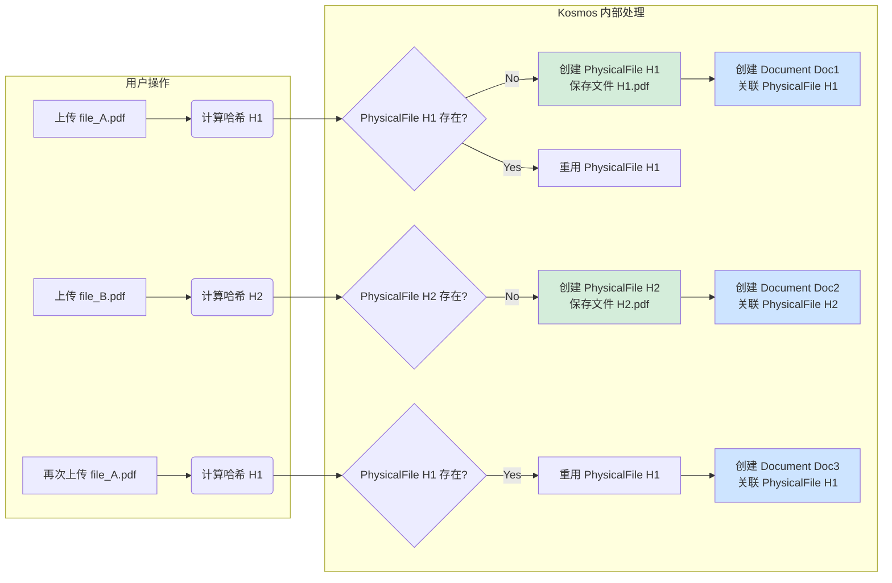

# 研究者文档：02 - 知识管理与任务调度

本文档深入探讨 Kosmos 系统在知识管理层面的核心设计，包括知识库、文档和知识块（Chunk）的生命周期管理，并详细解析其为保证系统响应性和数据一致性而采用的存储优化策略与异步任务调度机制。

## 1. 知识库管理 (`KBService`)

知识库（Knowledge Base, KB）是 Kosmos 中知识的顶层组织单元。`KBService` 负责其完整的生命周期管理。

-   **创建与归属**: 每个知识库在创建时都必须指定一位**拥有者 (Owner)**。Owner 拥有对该知识库的最高管理权限，包括删除知识库、管理所有成员等。
-   **成员与角色**: 系统通过 `KBMember` 模型实现多用户协作。用户在知识库中的角色分为三种：
    -   `owner`: 拥有者，唯一且拥有所有权限。
    -   `admin`: 管理员，可管理文档和成员（除 Owner ��）。
    -   `member`: 普通成员，通常拥有文档上传和查阅权限。
-   **核心资产：标签字典**: 每个知识库都维护一个独立的 `tag_dictionary`。这是该知识库领域知识的结构化体现，也是其智能的核心。所有后续的智能标注（Tagging）和知识治理（SDTM）都围绕这个字典展开。

## 2. 文档生命周期与存储优化 (`DocumentService`)

为了在支持海量文档的同时避免冗余存储，Kosmos 采用了一套精巧的**内容寻址存储 (Content-Addressable Storage)** 策略。这套机制通过分离**物理文件**和**逻辑文档**的概念来实现。

### 2.1. 设计理念

-   **`PhysicalFile`**: 代表一个**独一无二的物理文件**。它的主键是文件内容的 SHA256 哈希值。这意味着，无论一个文件被上传多少次，只要其内容不变，它在磁盘上就只会被存储**一份**。
-   **`Document`**: 代表一次**上传事件**。每当用户上传一个文件，系统都会创建一个新的 `Document` 记录。这使得追踪每个文件的上传历史（谁在何时上传）成为可能。
-   **`KBDocument`**: 一个**关联记录**，表示某个 `Document` 被添加到了某个 `KnowledgeBase` 中。

### 2.2. 工作流程

-   **上传**:
    1.  当用户上传文件时，`DocumentService` 首先计算其内容的哈希值。
    2.  系统检查 `PhysicalFile` 表中是否存在该哈希值的记录。
    3.  **如果不存在**：系统将文件保存到磁盘（通常以哈希值命名），并创建一个新的 `PhysicalFile` 记录，其引用计数 `reference_count` 为 1。
    4.  **如果已存在**：系统直接重用该 `PhysicalFile` 记录，并将其 `reference_count` 加 1。
    5.  无论物理文件是否存在，系统都会创建一个新的 `Document` 记录来代表这次上传，并创建一个 `KBDocument` 记录将其与目标知识库关联。

-   **删除**:
    1.  当用户从知识库中删除一个文档时，系统首先删除 `KBDocument` 关联记录。
    2.  接着，将对应 `PhysicalFile` 的 `reference_count` 减 1。
    3.  **只有当 `reference_count` 降为 0 时**，系统才会真正地从磁盘上删除该物理文件并清除其 `PhysicalFile` 记录。

这种设计带来了巨大的好处：**极大地节省了存储空间**，并实现了文件的**秒传**（对于已存在的文件）。

## 3. 索引失效检测与知识健康度

Kosmos 不仅仅存储知识，更要确保知识的**一致性**和**有效性**。一个关键的健康度指标是**索引时效性**。

-   **什么是索引失效？**
    当一个知识库的 `tag_dictionary`（标签字典）被更新后，那些基于**旧字典**生成的文档标签和知识块（Chunks）就变得“过时”了。因为它们不再能准确反映当前知识库的知识结构。

-   **如何检测？**
    `DocumentService` 在获取文档列表时，会进行一次关键的时间戳比较：
    -   `KnowledgeBase.last_tag_directory_update_time` (标签字典最后更新时间)
    -   `KBDocument.last_ingest_time` (文档最后摄入时间)

    如果 `last_tag_directory_update_time` **晚于** `last_ingest_time`，系统就会将该文档标记为**“索引失效” (Index Outdated)**。

-   **意义何在？**
    这个机制是知识治理的核心一环。它使得系统能够：
    1.  在 UI 界面上明确提示用户哪些文档需要重新处理。
    2.  为自动化的再索引（Re-ingestion）任务提供清晰的目标列表。
    3.  确��知识库内的所有知识块都与最新的知识本体（标签字典）保持一致，从而保证搜索和分析的准确性。

## 4. 异步任务调度与批处理

文档摄入是一个典型的重度计算任务，涉及文件解析、图像识别、向量化等多个耗时步骤。如果同步执行，极易导致 API 超时和糟糕的用户体验。

Kosmos 采用**异步任务队列**机制来优雅地解决这个问题，该机制的核心是 `IngestionService`。

### 4.1. 异步工作流

1.  **任务提交**: 当用户上传文档时，API 端点 (`/documents` 路由) 并不直接开始处理文件。它只做三件轻量级的事情：
    a.  对请求进行快速验证（如文件大小、类型）。
    b.  在数据库中创建一个 `IngestionJob` 记录，状态为 `pending`。
    c.  将真正的处理逻辑（`_run_pipeline_sync` 函数）连同 `job_id` 等参数，作为一个**任务**推送到后台的任务队列中。

2.  **立即响应**: API 立即向用户返回一个 `job_id`，整个请求-响应周期非常短暂。

3.  **后台处理**: 一个或多个独立的**工作进程 (Worker)** 持续监听任务队���。当发现新任务时，其中一个 Worker 会接收该任务并开始执行。
    a.  Worker 首先更新 `IngestionJob` 的状态为 `processing`。
    b.  然后，它会完整地执行整个文档摄入管线。
    c.  执行完毕后，根据结果将 `IngestionJob` 的状态更新为 `completed` 或 `failed`（并记录错误信息）。

4.  **状态查询**: 用户可以使用第一步获得的 `job_id`，通过专门的 API 端点轮询任务的执行状态。

### 4.2. 优势

-   **高响应性**: API 接口始终保持高可用和快速响应。
-   **高可靠性**: 即使处理过程中发生错误，任务状态也会被忠实记录，便于追踪和重试。
-   **可伸缩性**: 可以通过增加 Worker 进程的数量，轻松地横向扩展系统的批处理能力，以应对大量并发的摄入请求。

通过这套精巧的设计，Kosmos 确保了在提供强大知识管理功能的同时，依然能保持作为一个现代化网络服务应有的高性能和高可靠性。
