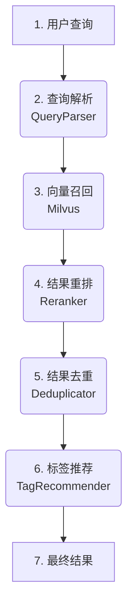

# 研究者文档：04 - 文档摄入与语义搜索管线

本文档为研究人员和高级开发者提供 Kosmos 两大核心工作流的深度技术解析：**文档摄入管线 (Ingestion Pipeline)** 和 **语义搜索管线 (Search Pipeline)**。这两个管线协同工作，将原始、异构的文档转化为可检索、可理解的知识，并为用户提供精准的查询体验。

---

## 第一部分：文档摄入管线

文档摄入是知识进入 Kosmos 系统的入口。其目标不仅仅是存储文件，而是通过一系列精密的步骤，将非结构化和半结构化的内容，处理成原子化的、带有丰富元数据和向量表示的**知识块 (Chunks)**。

该流程由 `app/services/ingestion_service.py` 编排，其核心步骤如下：

```mermaid
graph TD
    A[1. 原始文档<br>(PDF, JSON, DOCX...)] --> B(2. 处理器工厂<br>ProcessorFactory);
    B --> C{3. 内容提取与结构化};
    C -- PDF --> C1[PDFProcessor<br>页面截图/文本/图片描述];
    C -- JSON --> C2[JsonProcessor<br>转换为Markdown];
    C -- ... --> C3[其他处理器];
    
    subgraph "结构化内容块"
        C1
        C2
        C3
    end

    C1 & C2 & C3 --> D(4. 智能文本分块<br>IntelligentTextSplitter);
    D --> E(5. 块级去重<br>Deduplicator);
    E --> F(6. 向量化与存储);
    F --> G[SQLite<br>存储Chunk元数据];
    F --> H[Milvus<br>存储Chunk向量];
    E --> I(7. 截图关联);
    I --> G;

    style G fill:#f9d5a9
    style H fill:#f9d5a9
```

### 步骤 1-3: 内容提取与结构化 (Processing & Structuring)

当一个文档被上传时，`IngestionService` 首先通过 `ProcessorFactory` 为其选择一个合适的**处理器 (Processor)**。每个处理器负责将一种特定的文件格式转换为统一的、结构化的内容块列表。

-   **PDF 处理 (`pdf_processor.py`)**:
    -   **页面截图**: 首先，为 PDF 的每一页生成高清截��，这些截图将作为后续知识溯源的视觉依据。
    -   **多模态内容提取**: 接着，处理器会逐页提取内容，包括：
        -   **文本块**: 提取页面中的所有文本。
        -   **图片描述**: 利用视觉语言模型 (VLM) 识别页面中的嵌入图片，并生成描述性文本。
    -   **结构化输出**: 最终，整个 PDF 被转换为一个包含“标题”（如“第 5 页”）、“文本块”和“图片描述”的有序列表，保留了原始文档的结构信息。

-   **JSON/JSONL 处理 (`json_processor.py`)**:
    -   该处理器非常适合处理 API 响应、日志文件等半结构化数据。
    -   它会将 JSON 的层级结构（键值对、列表）智能地转换为具有相应标题层级的 **Markdown 格式**。这使得原本机器可读的数据，也变得人类可读且易于被语言模型理解和索引。

### 步骤 4: 智能文本分块 (Intelligent Text Splitting)

从处理器获得的结构化内容块被送入 `IntelligentTextSplitter`。与简单的按字符数切分不同，该分割器会尊重内容的语义边界（如段落、标题、列表项），尽可能保证切分出的每个 Chunk 都是一个语义完整、上下文连贯的知识单元。

### 步骤 5: 块级去重 (Chunk Deduplication)

为了节省存储空间并提高搜索结果的多样性，`ingestion_service.py` 中的 `_deduplicate_chunks` 方法会对生成的 Chunks 进行去重。
-   **精确去重**: 通过计算 Chunk 内容的 MD5 哈希值，快速移除完全相同的文本块。
-   **相似度去重**: 通过计算文本间的 Jaccard 相似度，移除内容高度重叠（例如，页眉页脚、重复的法律条文）的文本块。

### 步骤 6: 向量化与存储 (Embedding & Storage)

-   **向量化**: 每个经过��重的 Chunk 都会被送入一个预训练的**文本向量化模型 (Embedding Model)**，生成一个高维向量。这个向量是该知识块在语义空间中的坐标。
-   **双重存储**:
    -   **关系型数据库 (SQLite/Postgres)**: 存储 Chunk 的元数据，包括其 ID、文本内容、所属文档、在文档中的索引、关联的截图 ID 等。
    -   **向量数据库 (Milvus)**: 存储 Chunk 的 ID 及其对应的语义向量，并为向量建立高效的索引，以备快速检索。

### 步骤 7: 截图关联 (Screenshot Association)

`ingestion_service.py` 中的 `_associate_chunks_with_screenshots` 方法负责将文本 Chunks 与其来源的页面截图进行关联。它通过分析 Chunk 内容中是否包含“第 X 页”等明确标记，或基于 Chunk 在文档中的顺序进行智能推断，将一个或多个相关的截图 ID 存入 Chunk 的元数据中。这为用户在查看搜索结果时提供了强大的**“回到原文”**的溯源能力。

---

## 第二部分：语义搜索管线

语义搜索管线由 `app/services/search_service.py` 负责，它实现了一套“召回-精排-去重”的先进检索流程。



### 步骤 1: 查询解析 (Query Parsing)

用户输入的查询首先由 `QueryParser` (`app/utils/query_parser.py`) 处理。该解析器能分离出：
-   **核心查询文本**: 用于生成语义向量。
-   **必须包含的标签 (`+tag`)**: 用于在向量检索时进行精确过滤。
-   **必须排除的标签 (`-tag`)**: 同上。
-   **期望的标签 (`~tag`)**: 用于在重排阶段对结果进行加权。

### 步骤 2: 向量召回 (Vector Recall)

核心查询文本被向量化后，系统在 Milvus 中执行一个带**元数据过滤**的近似最近邻 (ANN) 搜索。Milvus 会高效地返回在向量空间中与查询向量最接近，并且满足 `+tag` 和 `-tag` 过滤条件的 Top-K 个候选 Chunks。为了给后续步骤留出充足的处理空间，此阶段召回的数量（如 `top_k * 3`）通常远多于最终需要返回的数量。

### 步骤 3: 结果重排 (Reranking)

召回的候选集由 `Reranker` (`app/utils/reranker.py`) 进行二次排序。当前实现主要基于用户期望的标签 (`~tag`) 对结果进行加权：包含更多 `like_tags` 的 Chunk 会获得更高的分数。这个模块未来可以轻松扩展为使用更强大的交叉编码器 (Cross-encoder) 模型，以实现更深层次的语义相关性判断。

### 步骤 4: 结果去重 (Deduplication)

为了提升用户体验，避免在结果列表中看到大量重复或高度相似的信息，`Deduplicator` (`app/utils/deduplicator.py`) 会对重排后的结果进行去重处理。它综合了两种策略：
-   **字面值去重**: 基于内容哈希，移除完全一样的结果。
-   **语义去重**: 基于结果的**相关性分数**和**内容相似度**。如果两个结果的搜索相关性分数非常接近，并且其内容也高度相似，则系统会移除分数较低的那个。

### 步骤 5: 标签推荐 (Tag Recommendation)

在生成最终结果的同时，`TagRecommender` (`app/utils/recommender.py`) 会分析所有去重后结果中出现的标签，并基于它们的频率和分布，向用户推荐可能相关的其他标签。这有助于用户发现新的探索方向或优化他们的查询。

### 步骤 6: 返回结果

最终，经过层层筛选和优化的、最相关的、多样化的结果列表，连同推荐标签和统计数据，被返回给用户。
