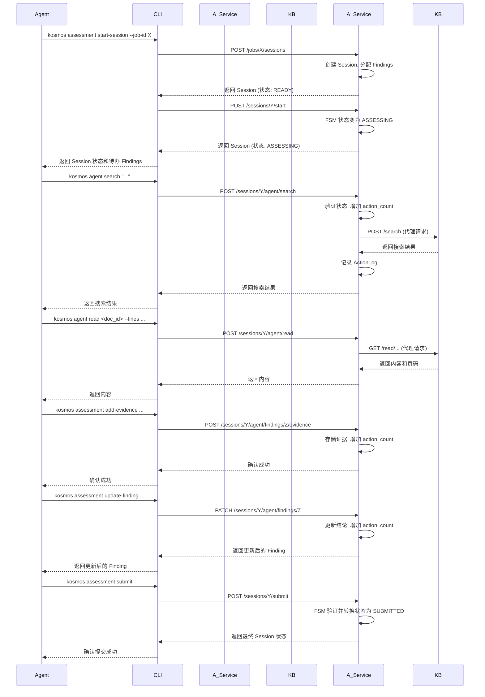

# Kosmos 平台开发现状报告

**版本:** 1.0
**日期:** 2025年9月13日

## 1. 产品定义

**Kosmos** 是一个**工业级智能知识管理平台**。

它的核心目标是将海量的、异构的、非结构化的数据（如 Office 文档、PDF、压缩包等）转化为一个**持久、可靠、可追溯、可编程的知识库（Knowledge Base, KB）**。与传统的 RAG (Retrieval-Augmented Generation) 框架不同，Kosmos 的定位并非一个简单的开发“工具箱”，而是一个完整、端到端的“知识操作系统”。

该平台为两类核心用户设计：
1.  **人类专家：** 为开发者、数据科学家、业务分析师提供强大的知识探索、管理和监控工具。
2.  **自主 AI 代理 (Autonomous AI Agents)：** 为下一代自动化工作流（如数字审计员、研究助理）提供一个受控、可审计、状态化的知识访问和交互环境。

## 2. 价值主张

Kosmos 的核心价值主张根植于其对知识处理全链路的深度和精度，解决了传统 RAG 方案在生产环境中普遍存在的“浅层处理”和“可靠性不足”等痛点。

*   **极致的知识保真度与上下文完整性：**
    通过基于视觉语言模型（VLM）的深度文档解析，Kosmos 能够理解文档的**视觉布局**，完整保留标题层级、表格、图片等结构信息。它能自动处理内嵌对象和压缩包，确保任何信息都不会在摄入过程中丢失。

*   **无可辩驳的可追溯性与可信度：**
    这是 Kosmos 的“杀手级”特性。通过独创的 `ContentPageMapping` 机制，知识库中的**每一行文本**都能精确地映射回其在**原始 PDF 文档中的物理页码**。这为所有检索和生成结果提供了无可辩驳的溯源依据，是构建高可信度 AI 应用的基石。

*   **工业级的系统健壮性与可扩展性：**
    平台采用事件驱动的异步微服务架构。所有耗时操作（格式转换、内容提取、AI 分析）都通过后台任务队列进行处理。这种设计确保了 API 的高可用性和快速响应，并为系统的水平扩展和容错提供了坚实的基础。

*   **为下一代自动化工作流而生：**
    Kosmos 不仅是一个被动的知识库，更是一个主动的 Agent 协作平台。通过专用的、有状态的任务服务器（如 `assessment_service`），它为 AI Agent 提供了“沙箱化”的、受控的工作流引擎，能够支持复杂、长周期、可审计的自动化任务。

## 3. 系统架构

Kosmos 平台采用现代分布式架构，由三个核心组件构成，它们之间通过 RESTful API 和消息队列进行通信。

### 3.1 系统架构图

```mermaid
graph TD
    subgraph 用户/Agent
        CLI[Kosmos CLI]
    end

    subgraph Kosmos 平台
        subgraph 任务服务器 (Task Servers)
            direction LR
            GenericWorkers[通用工作单元 (Workers)]
            AssessmentService[评估服务 (Assessment Service)]
        end

        subgraph 核心知识库 (Kosmos KB - Backend)
            APIService[API 服务 (FastAPI)]
            DB[(SQL 数据库<br>PostgreSQL/SQLite)]
            ObjectStorage[(对象存储<br>MinIO)]
            VectorDB[(向量数据库<br>Milvus)]
            MessageQueue[(任务队列<br>Redis + Dramatiq)]
        end
    end

    CLI -- REST API --> APIService
    CLI -- REST API (工作流) --> AssessmentService

    APIService -- 创建任务 --> MessageQueue
    APIService -- 读写状态/元数据 --> DB
    APIService -- 读写文件 --> ObjectStorage

    GenericWorkers -- 获取任务 --> MessageQueue
    GenericWorkers -- 更新状态 --> APIService
    GenericWorkers -- 读写文件 --> ObjectStorage
    GenericWorkers -- 写入向量 --> VectorDB

    AssessmentService -- 代表Agent调用 --> APIService
    AssessmentService -- 管理自身状态 --> FSM_DB[(独立数据库<br>assessment.db)]

    APIService -- 语义搜索 --> VectorDB
```

### 3.2 组件概述

*   **a. Kosmos 知识库 (KB - Backend):**
    这是系统的核心，是数据、逻辑和事实的唯一来源。它负责数据持久化（SQL）、对象存储（MinIO）、向量索引（Milvus）、任务分发（Redis/Dramatiq）以及暴露核心 API 服务。

*   **b. Kosmos 任务服务器 (Task Servers):**
    这是系统的“劳动力”，负责执行所有后台任务。它分为两类：
    *   **通用工作单元 (`workers`):** 执行文档摄入、分块、索引等标准化流程。
    *   **专用服务 (`assessment_service`):** 作为一个有状态的微服务，它不仅能执行任务，还暴露自己的 API 来管理一个特定的、有状态的工作流（如安全评估），并充当 Agent 与核心 KB 之间的**受控代理**。

*   **c. Kosmos 命令行接口 (CLI):**
    这是用户或 Agent 与平台交互的主要入口。它实现了**双重交互模式**：对于通用操作，直接与核心 KB 通信；对于特定的工作流，则与相应的任务服务器（如 `assessment_service`）通信。

## 4. 组件实现

### 4.1 Kosmos 知识库 (KB) - Backend

#### a. 文档摄入流水线 (Ingestion Pipeline)

这是 Kosmos 最精密和强大的部分，它确保了知识的深度和保真度。

**业务流程图:**
```mermaid
graph TD
    A[用户通过 CLI 上传文件] --> B{发布 DocumentRegistered 事件};
    B --> C[通用 Worker 接收事件];
    C --> D{格式转换 (如 DOCX -> PDF)};
    D --> E[VLM 内容提取 (MinerU)];
    E --> F{资产提取与去重};
    F --> G[范式化内容生成与去重];
    G --> H[建立文本行 -> PDF页码映射];
    H --> I{发布 ContentExtracted 事件};
    I --> J[触发 CHUNKING 作业];
    I --> K[并行触发 ASSET_ANALYSIS 作业];
    J --> L[结构化分块 (Chunking)];
    L --> M{发布 ChunkingCompleted 事件};
    M --> N[触发 INDEXING 作业];
    N --> O[向量化并索引至 Milvus];
    K --> P[VLM 资产分析];
```

*   **事件驱动:** 整个流程由 `DomainEvent` 驱动，各阶段完全解耦。
*   **多级去重:** 在原始文件 (`Original`)、范式化内容 (`CanonicalContent`) 和资产 (`Asset`) 三个层面实现基于 SHA256 哈希的内容去重。
*   **精确映射:** `ContentPageMapping` 模型是实现精确溯源的核心。

#### b. 内容访问层

提供三种互补的访问方式：
1.  **Search (搜索):** 采用**向量召回 + 关键词召回**的混合策略，并通过增强器（Boosters）和丰富的过滤器进行精确排序。
2.  **Grep (模式匹配):** 提供在指定文档范围内进行**正则表达式**搜索的能力，用于精确查找。
3.  **Read (定位读取):** 允许按**行号或百分比**读取文档的任意片段，并自动附加上下文元数据（**原始页码**、关联资产及其描述）。

### 4.2 Kosmos 任务服务器 - Assessment Service

`assessment_service` 是一个实现了复杂业务逻辑的专用服务器。

*   **工作流引擎:**
    *   拥有独立的数据库 (`assessment.db`) 来管理评估任务 (`AssessmentJob`) 和会话 (`AssessmentSession`) 的状态。
    *   使用**有限状态机 (FSM)** (`fsm.py`) 严格控制 `AssessmentSession` 的生命周期，确保了评估流程的规范性和一致性。
*   **中介代理:**
    *   所有 `kosmos agent *` 命令都指向此服务。
    *   服务在代理 Agent 请求时，会执行**权限验证、状态检查、资源限制（操作次数）和审计日志记录**等关键操作。

### 4.3 Kosmos 命令行接口 (CLI)

CLI 是一个设计精良的交互门户。

*   **有状态客户端 (`KosmosClient`):** 封装了所有 API 调用，并能自动处理用户会话的 Token 加载与刷新。
*   **动态命令加载:** 插件化的命令结构 (`cli/commands/`) 使得添加新功能无需修改核心代码。
*   **自动化友好:** 严格分离标准输出（JSON 结果）和标准错误（日志信息），极大地便利了 Agent 或脚本的调用和集成。

## 5. 使用案例

### 案例一：高可信度智能问答

*   **场景:** 用户询问一个复杂的技术或合规问题。
*   **流程:**
    1.  用户使用 `kosmos search` 提问。
    2.  Kosmos 的混合检索策略找到最相关的文本块 (`Chunk`)。
    3.  LLM Agent 根据这些 `Chunk` 的内容生成答案。
    4.  **关键点:** 答案的每一部分都附带了来源信息，包括**文件名、起始行号**，以及通过 `read` 接口获得的**原始 PDF 页码**。用户可以一键跳转到源文档的精确位置进行验证。

### 案例二：自动化合规审计

*   **场景:** 一个“数字审计员” Agent 需要根据某项安全标准（如 等级保护2.0），评估知识库中的一系列技术文档。
*   **流程:** 这是一个由 `assessment_service` 驱动的、有状态的长工作流。

**事件时序图:**


## 6. 评估分析

### 优势 (Strengths)

*   **设计思想先进:** 平台的设计深度远超主流 RAG 框架，真正从“知识管理”而非“文本检索”的角度出发，构建了一个坚实的基础。
*   **高保真与高可信:** 对知识源头的极致尊重和精确表示，是其最核心的竞争力。
*   **架构健壮:** 事件驱动和异步任务设计使其足以应对生产环境的挑战。
*   **Agent 就绪:** 创新的“中介代理”模式为实现复杂、可靠的自动化工作流铺平了道路。

### 潜在风险与挑战

*   **系统复杂性:** 强大的功能带来了较高的系统复杂性，对开发和运维人员的要求较高。
*   **依赖管理:** 系统依赖多个外部组件（MinIO, Milvus, Redis, LibreOffice, VLM模型），需要建立完善的部署和监控体系。
*   **性能瓶颈:** 深度文档解析流水线虽然功能强大，但也可能成为性能瓶颈，需要持续的性能分析和优化。

### 后续发展建议

*   **图形化用户界面 (GUI):** 开发一个 Web 界面，为非技术用户提供知识检索、文档管理和任务监控的可视化操作。
*   **Agent 工作流泛化:** 将 `assessment_service` 的模式抽象成一个通用的“工作流服务模板”，使用户可以自定义和部署不同领域的 Agent 工作流。
*   **增强可观测性:** 建立统一的 Dashboard，用于监控 Job 状态、事件流转、系统资源占用和 Agent 行为，提高系统的透明度和可维护性。
*   **深化本体论系统 (Ontology System):** 当前数据模型已包含本体论相关表，下一步应着力实现知识图谱的构建与应用，让知识之间的关系可被查询和推理，实现从“知识库”到“知识图谱”的飞跃。
